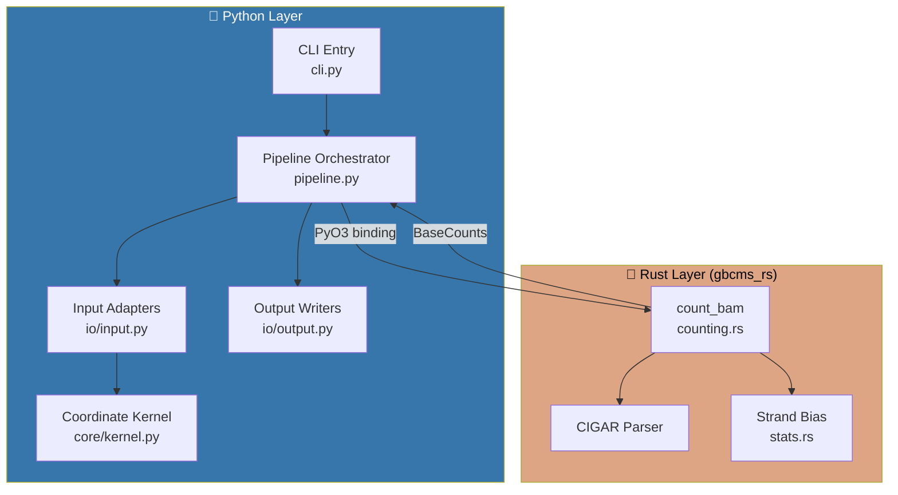
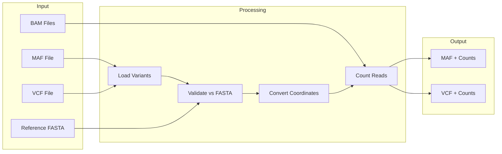
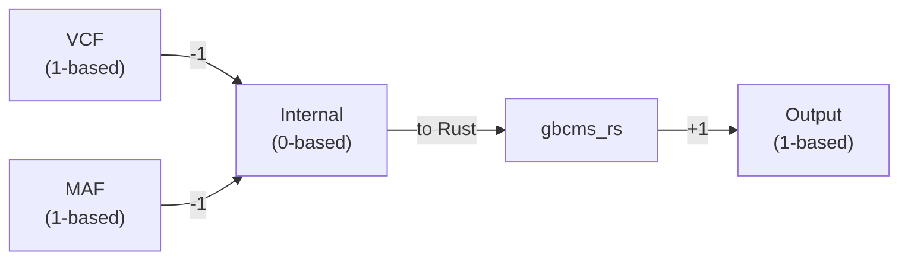
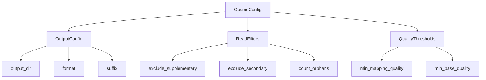

# Architecture

This document describes the py-gbcms system architecture, including the Python/Rust split, data flow, and coordinate handling.

## System Overview

py-gbcms is a hybrid Python/Rust application that counts allele-supporting reads at variant positions in BAM files.



---

## Data Flow



---

## Module Organization

```
py-gbcms/
├── src/gbcms/
│   ├── cli.py           # Typer CLI entry point
│   ├── pipeline.py      # Orchestrates counting workflow
│   ├── core/
│   │   └── kernel.py    # Coordinate normalization
│   ├── io/
│   │   ├── input.py     # VCF/MAF readers
│   │   └── output.py    # VCF/MAF writers
│   ├── models/
│   │   └── core.py      # Pydantic config models
│   └── utils/
│       └── logging.py   # Structured logging
├── rust/                # Rust crate (gbcms_rs)
│   └── src/
│       ├── lib.rs       # PyO3 module entry
│       ├── counting.rs  # BAM counting logic
│       ├── stats.rs     # Fisher's exact test
│       └── types.rs     # Variant, BaseCounts
```

---

## Coordinate System

All coordinates are normalized to **0-based, half-open** internally:



| Format | Position System | Example |
|:-------|:----------------|:--------|
| VCF | 1-based | chr1:100 |
| MAF | 1-based | chr1:100 |
| Internal | 0-based | chr1:99 |
| Rust | 0-based | chr1:99 |

---

## Rust-Python Interface

The Rust `count_bam` function is exposed via PyO3:

```python
# Python call
from gbcms_rs import count_bam, Variant

results = count_bam(
    bam_path="sample.bam",
    variants=[Variant("chr1", 99, "A", "T", "SNP")],
    fasta_path="ref.fa",
    min_mapq=20,
    min_baseq=0,
)
```

Returns `List[BaseCounts]` with:
- `ref_count`, `alt_count` (read-level)
- `ref_count_fragment`, `alt_count_fragment` (fragment-level)
- Strand-specific counts
- Fisher's exact test p-value for strand bias

---

## Configuration Hierarchy



See `src/gbcms/models/core.py` for the Pydantic model definitions.
