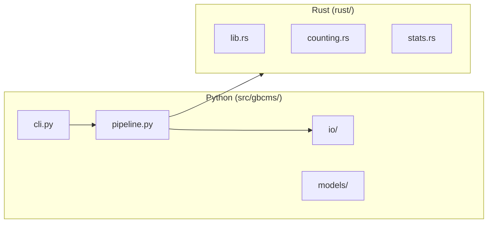

# Developer Guide

This guide covers development setup, code standards, and workflow for contributing to py-gbcms.

## Development Setup

### Prerequisites

- Python 3.10+
- Rust toolchain (rustup)
- maturin (for Rust/Python builds)

### Quick Start

```bash
# Clone repository
git clone https://github.com/msk-access/py-gbcms.git
cd py-gbcms

# Create virtual environment
python -m venv .venv
source .venv/bin/activate

# Install in development mode
pip install -e ".[dev]"

# Build Rust extension
cd rust && maturin develop && cd ..

# Verify installation
gbcms --version
```

---

## Code Standards

### Python

| Standard | Requirement |
|:---------|:------------|
| **Type hints** | All public functions |
| **Docstrings** | Google style for all public APIs |
| **Exports** | `__all__` in every module |
| **Logging** | Use `logging` module, not `print()` |
| **Config** | Pydantic models for settings |

### Rust

| Standard | Requirement |
|:---------|:------------|
| **Documentation** | `///` doc comments on public items |
| **Error handling** | `anyhow::Result` for fallible ops |
| **Logging** | `log` crate via `pyo3-log` |

---

## Project Layout



---

## Git Workflow

We use **git-flow** with these branches:

| Branch | Purpose |
|:-------|:--------|
| `main` | Production releases |
| `develop` | Integration branch |
| `feature/*` | New features |
| `release/*` | Release candidates |
| `hotfix/*` | Production fixes |

### Feature Development

```bash
# Start feature
git checkout develop
git checkout -b feature/my-feature

# Commit work
git add -A && git commit -m "feat: add feature"

# Merge back
git checkout develop
git merge feature/my-feature
```

---

## Code Quality Checklist

Before committing, verify:

- [ ] **Logging** — proper levels, no `print()`, timing included
- [ ] **Docstrings** — all public functions documented
- [ ] **Type hints** — complete annotations
- [ ] **Tests** — new code has test coverage
- [ ] **No dead code** — unused imports/functions removed
- [ ] **`__all__`** — exports match public API

---

## Building the Rust Extension

```bash
# Development build (fast, unoptimized)
cd rust
maturin develop

# Release build (optimized)
maturin develop --release

# Build wheel
maturin build --release
```

---

## Environment Variables

| Variable | Default | Description |
|:---------|:--------|:------------|
| `GBCMS_LOG_LEVEL` | `INFO` | Logging verbosity |
| `RUST_LOG` | — | Rust-side logging |

Set logging for debugging:

```bash
GBCMS_LOG_LEVEL=DEBUG RUST_LOG=debug gbcms run ...
```
