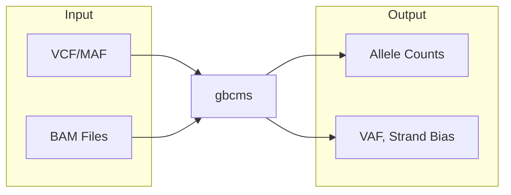
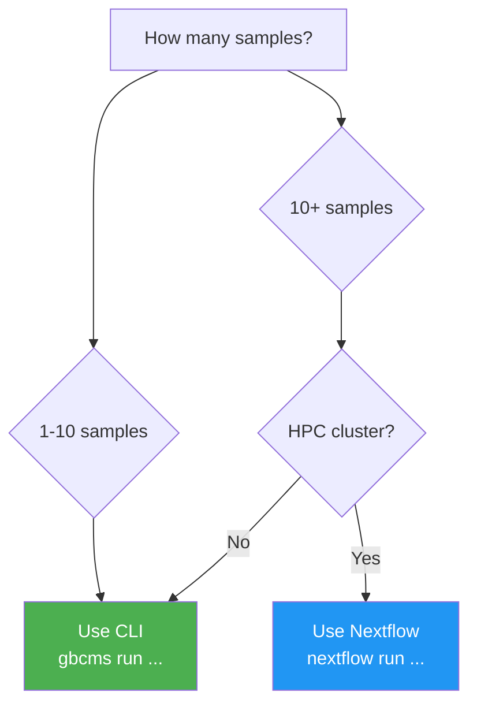
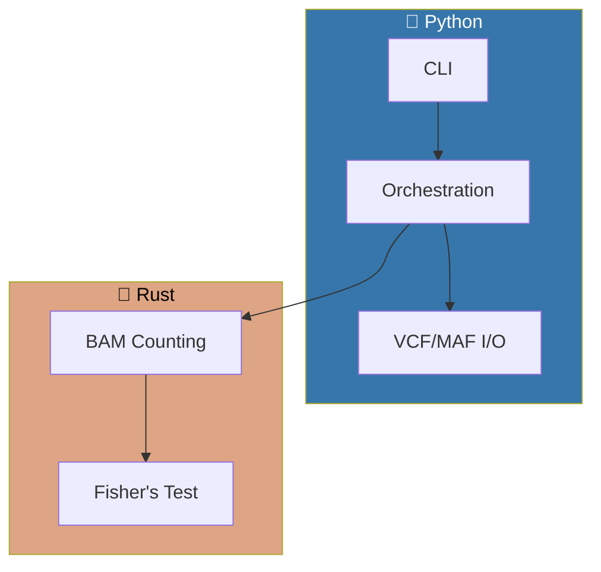

# py-gbcms

> **Get Base Counts Multi-Sample** — High-performance variant counting from BAM files

[](https://pypi.org/project/py-gbcms/)
[](https://pypi.org/project/py-gbcms/)
[](https://github.com/msk-access/py-gbcms/blob/main/LICENSE)

## What It Does

gbcms extracts **allele counts** and **variant metrics** at specified positions in BAM files:



### Key Metrics

| Metric | Formula | Description |
|:-------|:--------|:------------|
| **VAF** | `AD / (RD + AD)` | Variant Allele Frequency |
| **Strand Bias** | Fisher's exact test | Detect sequencing artifacts |
| **Fragment Counts** | Deduplicated pairs | PCR-aware counting |

---

## Quick Start

```bash
# Install
pip install py-gbcms

# Run
gbcms run --variants variants.vcf --bam sample.bam --fasta ref.fa --output-dir results/
```

**→ [Full Installation Guide](INSTALLATION.md)** | **→ [CLI Examples](quick-start.md)**

---

## Choose Your Workflow



| Workflow | Best For | Guide |
|:---------|:---------|:------|
| **CLI** | 1-10 samples, local/single server | [Quick Start](quick-start.md) |
| **Nextflow** | 10+ samples, HPC/SLURM | [Nextflow Guide](NEXTFLOW.md) |

---

## Architecture

Python/Rust hybrid for maximum performance:



**→ [Technical Details](ARCHITECTURE.md)**

---

## Links

- **[Installation](INSTALLATION.md)** — PyPI, Docker, source
- **[CLI Guide](quick-start.md)** — Command examples  
- **[Nextflow](NEXTFLOW.md)** — HPC pipeline
- **[Contributing](CONTRIBUTING.md)** — Development guide
- **[Changelog](CHANGELOG.md)** — Version history
