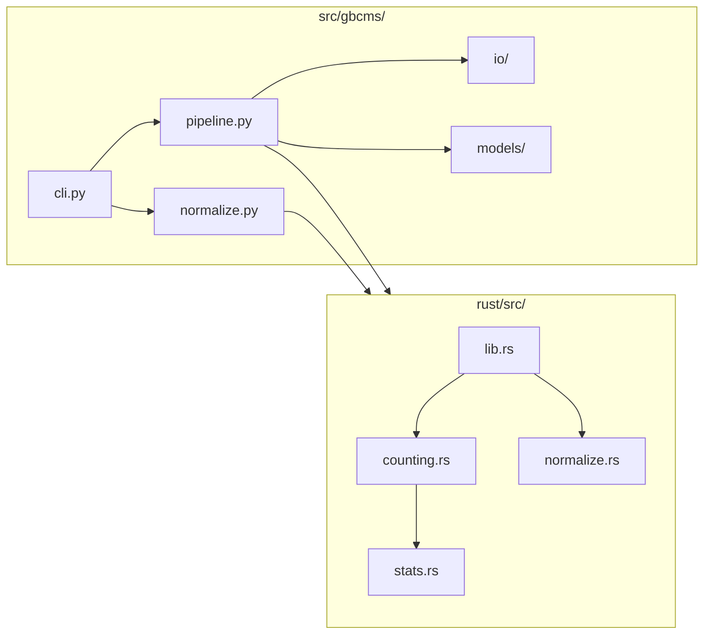
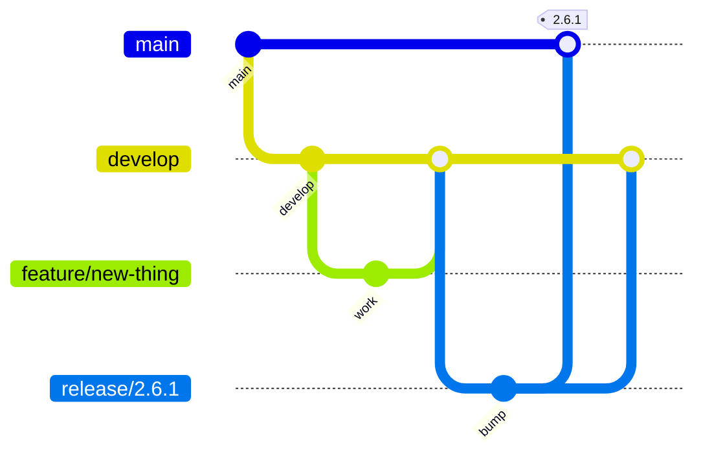

# Developer Guide

Guide for contributing to py-gbcms.

---

## Setup

=== "Modern Linux (Ubuntu 22.04+, RHEL 9+)"
    ```bash
    # Clone
    git clone https://github.com/msk-access/py-gbcms.git
    cd py-gbcms
    
    # Virtual environment
    python -m venv .venv
    source .venv/bin/activate
    
    # Install Rust (if not installed)
    curl --proto '=https' --tlsv1.2 -sSf https://sh.rustup.rs | sh
    
    # Install (builds Rust extension)
    maturin develop --release
    
    # Verify
    gbcms --version
    ```

=== "Legacy Linux (RHEL 8 / HPC)"
    ```bash
    # Clone
    git clone https://github.com/msk-access/py-gbcms.git
    cd py-gbcms
    
    # Create conda environment with build dependencies
    # Note: clangdev (not clang) provides headers needed by bindgen
    conda create -n gbcms-dev python=3.11 clangdev rust -c conda-forge
    conda activate gbcms-dev
    
    # Set libclang path for the Rust build
    export LIBCLANG_PATH=$CONDA_PREFIX/lib
    
    # Install maturin and build
    pip install maturin
    maturin develop --release
    
    # Verify
    gbcms --version
    ```

=== "macOS"
    ```bash
    # Clone
    git clone https://github.com/msk-access/py-gbcms.git
    cd py-gbcms
    
    # Install Rust (if not installed)
    curl --proto '=https' --tlsv1.2 -sSf https://sh.rustup.rs | sh
    
    # Virtual environment
    python -m venv .venv
    source .venv/bin/activate
    
    # Install (builds Rust extension)
    maturin develop --release
    
    # Verify
    gbcms --version
    ```

---

## Project Structure



---

## Build Commands

```bash
# Development (fast)
maturin develop

# Release (optimized)
maturin develop --release

# Build wheel
maturin build --release --out dist
```

---

## Code Standards

### Python

| Standard | Requirement |
|:---------|:------------|
| Type hints | All public functions |
| Docstrings | Google style |
| Exports | `__all__` in every module |
| Logging | Use `logging`, not `print()` |
| Config | Pydantic models |

### Rust

| Standard | Requirement |
|:---------|:------------|
| Docs | `///` on public items |
| Errors | `anyhow::Result` |
| Logging | `log` crate |

---

## Git Workflow (git-flow)



| Branch | Purpose |
|:-------|:--------|
| `main` | Production releases |
| `develop` | Integration |
| `feature/*` | New features |
| `release/*` | Release candidates |
| `hotfix/*` | Production fixes |

---

## Quality Checklist

Before committing:

- [ ] `make lint` passes
- [ ] `pytest` passes
- [ ] Type hints complete
- [ ] Docstrings added
- [ ] No dead code

---

## Environment Variables

| Variable | Default | Description |
|:---------|:--------|:------------|
| `GBCMS_LOG_LEVEL` | INFO | Logging level |
| `RUST_LOG` | — | Rust logging |

```bash
GBCMS_LOG_LEVEL=DEBUG RUST_LOG=debug gbcms run ...
```
