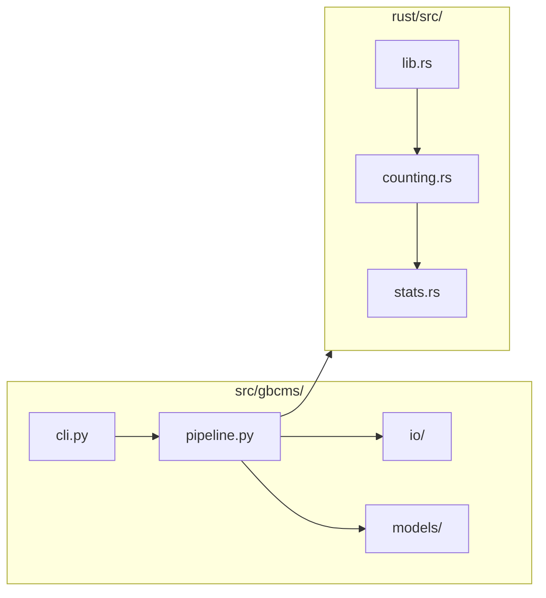

# Developer Guide

Guide for contributing to py-gbcms.

---

## Setup

```bash
# Clone
git clone https://github.com/msk-access/py-gbcms.git
cd py-gbcms

# Virtual environment
python -m venv .venv
source .venv/bin/activate

# Install (builds Rust extension)
maturin develop --release

# Verify
gbcms --version
```

---

## Project Structure



---

## Build Commands

```bash
# Development (fast)
maturin develop

# Release (optimized)
maturin develop --release

# Build wheel
maturin build --release --out dist
```

---

## Code Standards

### Python

| Standard | Requirement |
|:---------|:------------|
| Type hints | All public functions |
| Docstrings | Google style |
| Exports | `__all__` in every module |
| Logging | Use `logging`, not `print()` |
| Config | Pydantic models |

### Rust

| Standard | Requirement |
|:---------|:------------|
| Docs | `///` on public items |
| Errors | `anyhow::Result` |
| Logging | `log` crate |

---

## Git Workflow (git-flow)


| Branch | Purpose |
|:-------|:--------|
| `main` | Production releases |
| `develop` | Integration |
| `feature/*` | New features |
| `release/*` | Release candidates |
| `hotfix/*` | Production fixes |

---

## Quality Checklist

Before committing:

- [ ] `make lint` passes
- [ ] `pytest` passes
- [ ] Type hints complete
- [ ] Docstrings added
- [ ] No dead code

---

## Environment Variables

| Variable | Default | Description |
|:---------|:--------|:------------|
| `GBCMS_LOG_LEVEL` | INFO | Logging level |
| `RUST_LOG` | — | Rust logging |

```bash
GBCMS_LOG_LEVEL=DEBUG RUST_LOG=debug gbcms run ...
```
