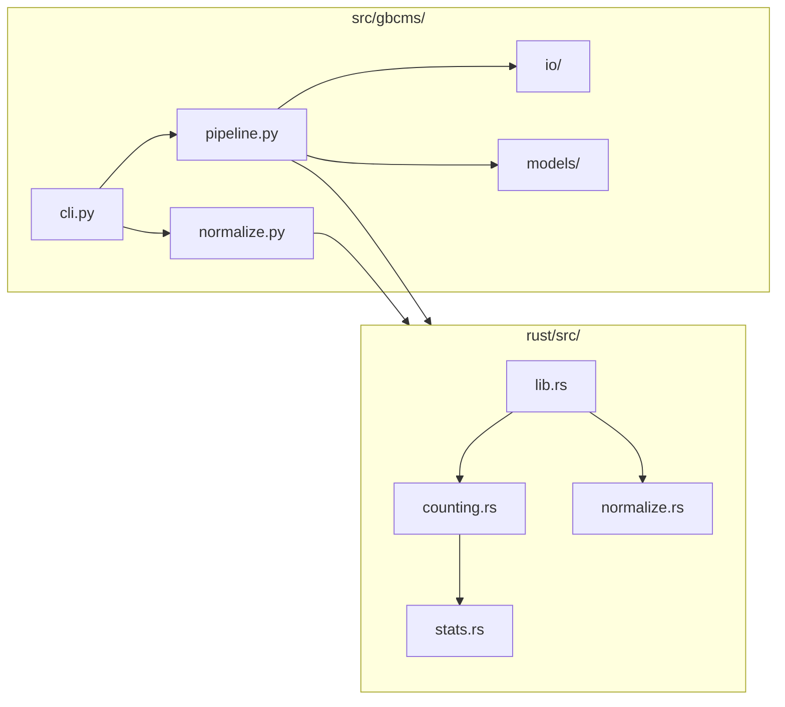
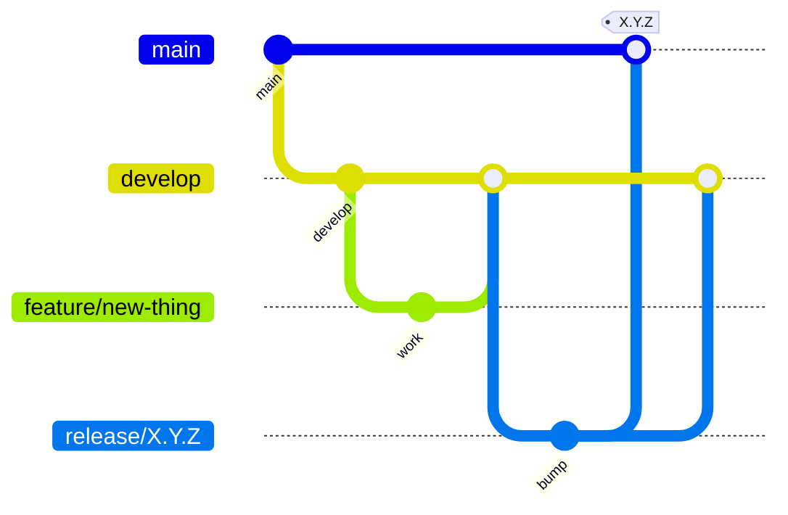

# Developer Guide

Guide for contributing to gbcms.

---

## Setup

=== "Modern Linux (Ubuntu 22.04+, RHEL 9+)"
    ```bash
    # Clone
    git clone https://github.com/msk-access/gbcms.git
    cd gbcms
    
    # Virtual environment
    python -m venv .venv
    source .venv/bin/activate
    
    # Install Rust (if not installed)
    curl --proto '=https' --tlsv1.2 -sSf https://sh.rustup.rs | sh
    
    # Install (builds Rust extension)
    maturin develop --release
    
    # Verify
    gbcms --version
    ```

=== "Legacy Linux (RHEL 8 / HPC)"
    ```bash
    # Clone
    git clone https://github.com/msk-access/gbcms.git
    cd gbcms
    
    # Create conda environment with build dependencies
    # Note: clangdev (not clang) provides headers needed by bindgen
    conda create -n gbcms-dev python=3.11 clangdev rust -c conda-forge
    conda activate gbcms-dev
    
    # Set libclang path for the Rust build
    export LIBCLANG_PATH=$CONDA_PREFIX/lib
    
    # Install maturin and build
    pip install maturin
    maturin develop --release
    
    # Verify
    gbcms --version
    ```

=== "macOS"
    ```bash
    # Clone
    git clone https://github.com/msk-access/gbcms.git
    cd gbcms
    
    # Install Rust (if not installed)
    curl --proto '=https' --tlsv1.2 -sSf https://sh.rustup.rs | sh
    
    # Virtual environment
    python -m venv .venv
    source .venv/bin/activate
    
    # Install (builds Rust extension)
    maturin develop --release
    
    # Verify
    gbcms --version
    ```

---

## Project Structure


```mermaid
flowchart LR
    subgraph Python["src/gbcms/"]
        CLI[cli.py] --> Pipeline[pipeline.py]
        CLI --> Normalize[normalize.py]
        Pipeline --> IO[io/]
        Pipeline --> Models[models/]
    end
    
    subgraph Rust["rust/src/"]
        Lib[lib.rs] --> Count[counting.rs]
        Lib --> Norm[normalize.rs]
        Count --> Stats[stats.rs]
    end
    
    Pipeline --> Rust
    Normalize --> Rust
```

---

## Build Commands

```bash
# Development (fast)
maturin develop

# Release (optimized)
maturin develop --release

# Build wheel
maturin build --release --out dist
```

---

## Regression Testing

### 22-BAM Regression Suite

For changes to the counting engine (`counting.rs`), run the 22-BAM regression
to verify no unintended count shifts:

1. Build the release binary:
   ```bash
   maturin develop --release
   ```

2. Run the regression script:
   ```bash
   python /tmp/run_regression_22.py
   ```

3. Review the comparison output. Key metrics:
   - **ALT count diff distribution**: most variants should be within ±2
   - **C++ higher**: investigate any new variants where C++ ALT > gbcms
   - **gbcms higher**: expected for windowed indel detection improvements

### Variant-Type-Specific BAM Slices

When debugging specific variant types, create targeted BAM slices:

| Variant Type | Key Samples | What to Check |
|:-------------|:------------|:--------------|
| MNP/DNP | TERT (5bp), BRCA2 (2bp), TP53 (4bp) | ALT recovery vs C++ |
| Indel | JAK1, ZFHX3 (shifted insertions) | Multi-allelic isolation |
| Complex | EPHA7, KDM6A (DelIns) | Phase 3 classification |

---

## Code Standards

### Python

| Standard | Requirement |
|:---------|:------------|
| Type hints | All public functions |
| Docstrings | Google style |
| Exports | `__all__` in every module |
| Logging | Use `logging`, not `print()` |
| Config | Pydantic models |

#### CLI Validation Standards

New CLI options must follow this four-layer validation order:

1. **Parse-time** (Typer): Use `Enum` for constrained choices, `min=`/`max=` for numeric ranges. Typer rejects invalid values before any Python code runs.
2. **Pre-model** (cli.py command body): File extension checks, cross-option semantics (e.g. `--preserve-barcode` + non-MAF input), charset validation. Log at `ERROR` and raise `typer.Exit(code=1)`.
3. **Model-time** (Pydantic): Business-logic constraints in `models/core.py` via `Field(ge=..., le=...)` and `@field_validator`.
4. **No silent skips**: Missing inputs must fail-fast or require an explicit opt-out (e.g. `--lenient-bam`). `WARNING`-level silent skips are unacceptable for missing required inputs.

The module-level docstring in `cli.py` documents this order and must be kept in sync when adding new options.

### Rust

| Standard | Requirement |
|:---------|:------------|
| Docs | `///` on public items |
| Errors | `anyhow::Result` |
| Logging | `log` crate |

---

## Git Workflow (git-flow)


```mermaid
gitGraph
    commit id: "main"
    branch develop
    commit id: "develop"
    branch feature/new-thing
    commit id: "work"
    checkout develop
    merge feature/new-thing
    branch release/X.Y.Z
    commit id: "bump"
    checkout main
    merge release/X.Y.Z tag: "X.Y.Z"
    checkout develop
    merge release/X.Y.Z
```

| Branch | Purpose |
|:-------|:--------|
| `main` | Production releases |
| `develop` | Integration |
| `feature/*` | New features |
| `release/*` | Release candidates |
| `hotfix/*` | Production fixes |

---

## Quality Checklist

Before committing:

- [ ] `make lint` passes
- [ ] `pytest` passes
- [ ] Type hints complete
- [ ] Docstrings added
- [ ] No dead code

---

## Environment Variables

| Variable | Default | Description |
|:---------|:--------|:------------|
| `GBCMS_LOG_LEVEL` | INFO | Logging level |
| `RUST_LOG` | — | Rust logging |

```bash
GBCMS_LOG_LEVEL=DEBUG RUST_LOG=debug gbcms run ...
```
