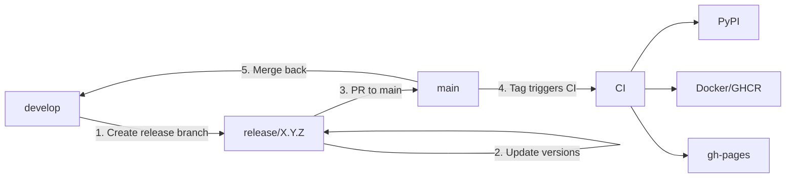

# Release Guide

This guide documents the complete release process for py-gbcms using git-flow workflow.

## Pre-Release Checklist

Before starting a release, ensure:

- [ ] All CI checks pass on `develop`
- [ ] All features for the release are merged to `develop`
- [ ] No blocking issues in milestone

---

## Version Locations

All these files must be updated with the new version (17 references total):

| File | Lines | Count | Format |
|:-----|:------|:-----:|:-------|
| `pyproject.toml` | 3 | 1 | `version = "X.Y.Z"` |
| `src/gbcms/__init__.py` | 11 | 1 | `__version__ = "X.Y.Z"` |
| `rust/Cargo.toml` | 3 | 1 | `version = "X.Y.Z"` |
| `nextflow/modules/local/gbcms/run/main.nf` | 7 | 1 | `container "ghcr.io/msk-access/py-gbcms:X.Y.Z"` |
| `docs/getting-started/installation.md` | 17,18,78,79,82,89,90,105,118 | 9 | Docker/Singularity pull/run/exec + expected version |
| `docs/getting-started/quickstart.md` | 107 | 1 | `ghcr.io/msk-access/py-gbcms:X.Y.Z` |
| `docs/development/developer-guide.md` | 144,147,149 | 3 | Git-flow diagram release branch labels |
| `CHANGELOG.md` | Top section | — | `## [X.Y.Z] - YYYY-MM-DD` (new entry) |

!!! tip "Verify all references"
    After updating, run this to ensure no stale versions remain:
    ```bash
    grep -rn "OLD_VERSION" --include="*.py" --include="*.toml" --include="*.nf" --include="*.md" . \
      | grep -v ".git/" | grep -v "site/" | grep -v "CHANGELOG"
    ```

---

## Release Workflow



---

## Step-by-Step Instructions

### 1. Create Release Branch

```bash
# From develop
git checkout develop
git pull origin develop

# Create release branch
git checkout -b release/X.Y.Z
```

### 2. Update Version Numbers

Update all version locations listed above. Use this command to verify:

```bash
# Check current versions
grep -E "^version|^__version__" pyproject.toml src/gbcms/__init__.py rust/Cargo.toml
grep "container" nextflow/modules/local/gbcms/run/main.nf
```

### 3. Update CHANGELOG.md

Add new section at top:

```markdown
## [X.Y.Z] - YYYY-MM-DD

### ✨ Added
- New feature description

### 🔧 Fixed
- Bug fix description

### 🔄 Changed
- Changes description
```

### 4. Run Pre-Release Checks

```bash
# Lint
make lint

# Format
make format

# Tests
make test

# Local build test
make docker-build
```

### 5. Commit and Push

```bash
git add -A
git commit -m "chore: bump version to X.Y.Z"
git push origin release/X.Y.Z
```

### 6. Create PR: release/X.Y.Z → main

- Title: `Release X.Y.Z`
- Describe changes from CHANGELOG
- Wait for CI to pass

### 7. Merge to main (creates tag)

After PR approval:
- Squash and merge to `main`
- **Create tag**: `git tag X.Y.Z && git push origin X.Y.Z`

### 8. CI Release Pipeline

The tag triggers `.github/workflows/release.yml`:

1. **Build wheels** (Linux x86_64, aarch64; macOS x86_64, arm64; Windows)
2. **Publish to PyPI** (via maturin)
3. **Build Docker image** → push to `ghcr.io/msk-access/py-gbcms:X.Y.Z`
4. **Deploy docs** → GitHub Pages (versioned via `mike` as `X.Y.Z` / `stable`)

### 9. Merge main back to develop

```bash
git checkout develop
git pull origin develop
git merge main
git push origin develop
```

### 10. Cleanup

```bash
# Delete local release branch
git branch -d release/X.Y.Z

# Delete remote release branch (optional)
git push origin --delete release/X.Y.Z
```

---

## Hotfix Workflow

For critical production fixes:

```bash
# Create hotfix from main
git checkout main
git checkout -b hotfix/X.Y.Z

# Fix, commit, push
git add -A
git commit -m "fix: critical issue description"
git push origin hotfix/X.Y.Z

# PR to main, then merge back to develop
```

---

## Automation Scripts

### git-flow-helper.sh

Interactive helper for git-flow operations:

```bash
./git-flow-helper.sh
# Options:
# 1) Create feature branch
# 2) Create release branch
# 3) Show git status
# 4) Cleanup merged branches
```

### Makefile Targets

| Target | Description |
|:-------|:------------|
| `make lint` | Run ruff and mypy |
| `make format` | Run black and ruff --fix |
| `make test` | Run pytest |
| `make test-cov` | Run tests with coverage |
| `make docker-build` | Build Docker image locally |

---

## CI Workflows

| Workflow | Trigger | Purpose |
|:---------|:--------|:--------|
| `test.yml` | Push to develop/main, PR | Run tests |
| `release.yml` | Tag push `X.Y.Z` | Build wheels, publish PyPI, Docker |
| `deploy-docs.yml` | Push to main or develop (docs/) | Deploy versioned docs via `mike` (`stable` from main, `dev` from develop) |

---

## Troubleshooting

### PyPI Upload Fails

- Check if version already exists on PyPI (versions cannot be overwritten)
- Verify `PYPI_TOKEN` secret is set in GitHub repository

### Docker Build Fails

- Check `Dockerfile` paths match the new folder structure
- Verify rust/Cargo.toml version matches

### Docs Build Fails

- Verify `mkdocs-mermaid2-plugin` is installed in workflow
- Check snippet paths are correct (relative to root)
