# py-gbcms

> **Get Base Counts Multi-Sample** — High-performance variant counting from BAM files

[](https://pypi.org/project/py-gbcms/)
[](https://pypi.org/project/py-gbcms/)
[](https://github.com/msk-access/py-gbcms/blob/main/LICENSE)

## What It Does

GBCMS extracts **allele counts** and **variant metrics** at specified positions in BAM files:


## Visual Overview

<figure markdown="span">
  { loading=lazy width="100%" }
  <figcaption>py-gbcms end-to-end pipeline — click to enlarge</figcaption>
</figure>

[:material-file-pdf-box: Download Detailed Overview (PDF, 4.1 MB)](assets/posters/High_Performance_cfDNA_Variant_Counting_cmp.pdf){ .md-button }

### Key Metrics

| Metric | Formula | Description |
|:-------|:--------|:------------|
| **VAF** | `AD / (RD + AD)` | Variant Allele Frequency |
| **Strand Bias** | Fisher's exact test | Detect sequencing artifacts |
| **Fragment Counts** | Deduplicated pairs | PCR-aware counting |

---

## Quick Start

```bash
# Install
pip install py-gbcms

# Run
gbcms run --variants variants.vcf --bam sample.bam --fasta ref.fa --output-dir results/
```

**→ [Full Installation Guide](getting-started/installation.md)** | **→ [CLI Examples](getting-started/quickstart.md)**

---

## Choose Your Workflow


| Workflow | Best For | Guide |
|:---------|:---------|:------|
| **CLI** | 1-10 samples, local/single server | [Quick Start](getting-started/quickstart.md) |
| **Nextflow** | 10+ samples, HPC/SLURM | [Nextflow Guide](nextflow/index.md) |

---

## Architecture

Python/Rust hybrid for maximum performance:

```mermaid
flowchart TB
    subgraph Python [🐍 Python]
        CLI[CLI] --> Pipeline[Orchestration]
        Pipeline --> IO[VCF/MAF I/O]
    end
    
    subgraph Rust [🦀 Rust]
        Counter[BAM Counting]
        Stats[Fisher Test]
    end
    
    Pipeline --> Counter
    Counter --> Stats
    
    classDef pythonStyle fill:#3776ab,color:#fff,stroke:#2c5f8a,stroke-width:2px;
    classDef rustStyle fill:#dea584,color:#000,stroke:#c48a6a,stroke-width:2px;
    class Python pythonStyle;
    class Rust rustStyle;
```



**→ [Technical Details](reference/architecture.md)** | **→ [How It Works](reference/allele-classification.md)**

---

## Documentation

| Section | Description |
|:--------|:------------|
| [Getting Started](getting-started/index.md) | Installation and first run |
| [CLI Reference](cli/index.md) | Command-line usage |
| [Nextflow Pipeline](nextflow/index.md) | HPC workflow |
| [How It Works](reference/architecture.md) | Architecture, algorithms, and formats |
| [Development](development/developer-guide.md) | Contributing guide |
