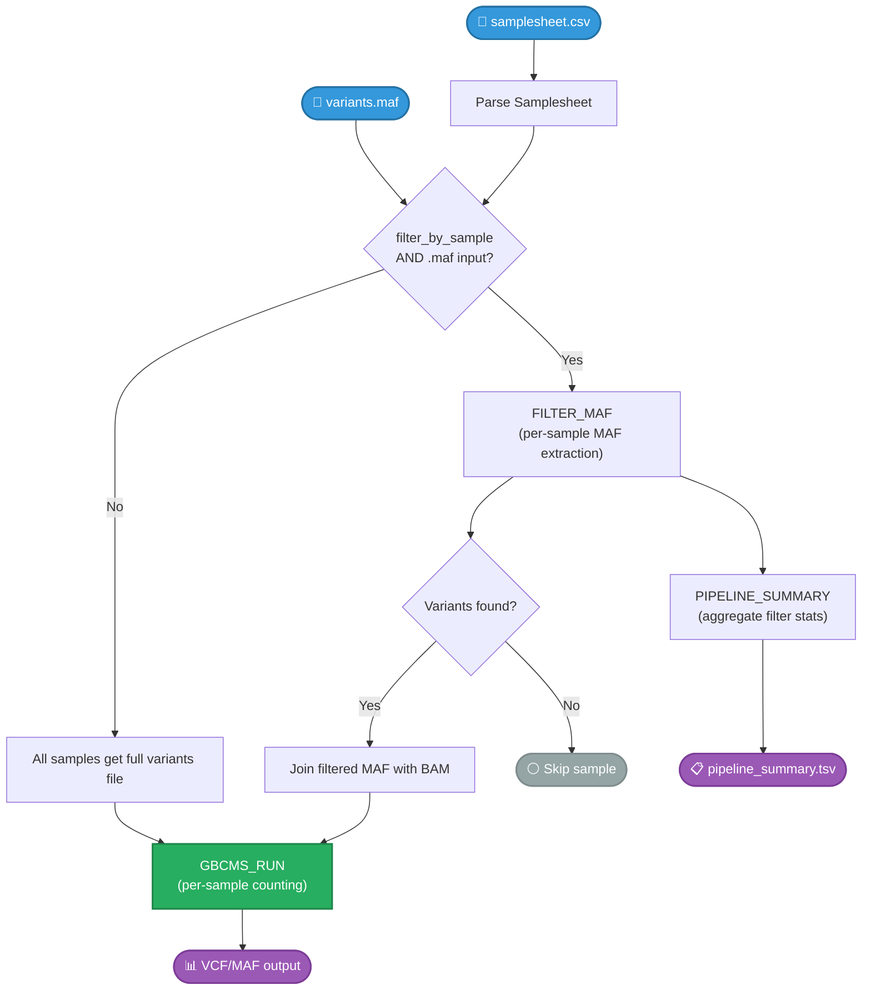

# Nextflow Pipeline

Run py-gbcms at scale on HPC clusters with automatic parallelization.

## Overview

The Nextflow workflow provides:

- **Automatic parallelization** across samples
- **SLURM/HPC integration** with resource management  
- **Containerization** with Docker/Singularity
- **Resume capability** for failed runs

## Pipeline Architecture



## Quick Start

```bash
nextflow run nextflow/main.nf \
    --input samplesheet.csv \
    --variants variants.vcf \
    --fasta reference.fa \
    -profile docker
```

## Documentation

| Page | Description |
|:-----|:------------|
| [Samplesheet](samplesheet.md) | Input CSV format |
| [Parameters](parameters.md) | All configuration options |
| [Examples](examples.md) | Common usage patterns |

## Related

- [CLI Reference](../cli/index.md) — For processing few samples
- [Troubleshooting](../resources/troubleshooting.md) — Common issues
