```mermaid
flowchart TD
    Start([🧬 SNP Check]):::start --> Walk[Walk CIGAR to variant pos]
    Walk --> Found{Position found?}
    Found -->|No| Neither1([Neither]):::neither
    Found -->|Yes| BQ{Base quality ≥ min_baseq?}
    BQ -->|No| Neither2([Neither]):::neither
    BQ -->|Yes| Compare[Compare base to REF and ALT]
    Compare --> IsRef{base == REF?}
    IsRef -->|Yes| Ref([✅ REF]):::ref
    IsRef -->|No| IsAlt{base == ALT?}
    IsAlt -->|Yes| Alt([🔴 ALT]):::alt
    IsAlt -->|No| Neither3([Neither]):::neither

    classDef start fill:#9b59b6,color:#fff,stroke:#7d3c98,stroke-width:2px;
    classDef ref fill:#27ae60,color:#fff,stroke:#1e8449,stroke-width:2px;
    classDef alt fill:#e74c3c,color:#fff,stroke:#c0392b,stroke-width:2px;
    classDef neither fill:#95a5a6,color:#fff,stroke:#7f8c8d,stroke-width:2px;
```

# Allele Classification

How py-gbcms classifies each read as supporting the **reference** allele, the **alternate** allele, or **neither**.

!!! tip "Detailed Visual Reference (PDF)"
    { type=application/pdf style="min-height:75vh;width:100%" }

## Dispatch

After passing [read filters](read-filters.md), each read is dispatched to a **type-specific** allele checker based on the variant's **allele lengths** (`ref_len` × `alt_len`), not on the `variant_type` string. This makes dispatch robust against inconsistent upstream type labels:

```mermaid
flowchart LR
    Fetch([📥 Fetch Reads]):::fetch --> Filter([🔍 Apply Filters]):::filter
    Filter --> Dispatch{"ref_len × alt_len?"}
    Dispatch -->|"1 × 1"| SNP[check_snp]
    Dispatch -->|"N × N"| MNP[check_mnp]
    Dispatch -->|"1 × N"| INS[check_insertion]
    Dispatch -->|"N × 1"| DEL[check_deletion]
    Dispatch -->|"else"| CPX[check_complex]
    MNP -.->|"inconclusive"| CPX
    INS -.->|"Phase 3 fallback"| CPX
    DEL -.->|"fallback (CIGAR mismatch)"| CPX
    SNP --> Count([📊 Update Counts]):::count
    INS --> Count
    DEL --> Count
    MNP --> Count
    CPX --> Count

    classDef fetch fill:#4a90d9,color:#fff,stroke:#2c6fad,stroke-width:2px;
    classDef filter fill:#e67e22,color:#fff,stroke:#bf6516,stroke-width:2px;
    classDef count fill:#27ae60,color:#fff,stroke:#1e8449,stroke-width:2px;
```



!!! info "Allele-Length Routing"
    Dispatch uses `ref_allele.len()` and `alt_allele.len()` to determine the variant class. This means even if upstream callers emit inconsistent type strings (e.g., `"COMPLEX"` for what is really a pure deletion after normalization), the correct checker is always selected.

---

## SNP (Single Nucleotide Polymorphism)

A single base substitution — the simplest and most common variant type.

| Property | Value |
|:---------|:------|
| Detection | `len(REF) == 1 && len(ALT) == 1` |
| Position | 0-based index of the substituted base |
| Quality check | Base quality at the position must meet `--min-baseq` |

### Algorithm



### Visual Example

```
Variant: chr1:100 C→T (SNP)

Reference: 5'─ ...G  A  T  C  G  A  T  C  G  A... ─3'
                          98 99 100 101
                               ▲
                           variant pos

Read 1:    5'─ ...G  A  T [T] G  A  T  C... ─3'   → ALT ✅
                               ↑
                          base=T matches ALT

Read 2:    5'─ ...G  A  T [C] G  A  T  C... ─3'   → REF ✅
                               ↑
                          base=C matches REF

Read 3:    5'─ ...G  A  T [A] G  A  T  C... ─3'   → Neither
                               ↑
                          base=A ≠ REF or ALT
```

---

## Insertion

Bases inserted after an **anchor** position. The anchor is the last reference base before the inserted sequence.

| Property | Value |
|:---------|:------|
| Detection | `len(REF) == 1 && len(ALT) > 1` |
| Position | 0-based index of the **anchor** base |
| Quality check | Quality-masked sequence comparison |

### Algorithm

The insertion check uses a **single CIGAR walk** with four detection strategies:

```mermaid
flowchart TD
    Start([🧬 Insertion Check]):::start --> Walk[Walk CIGAR left → right]
    Walk --> Found{Match block contains anchor?}
    Found -->|No| WindowCheck
    Found -->|Yes| Backward{Anchor at start of block AND prev op is Ins?}
    Backward -->|Yes| BWMatch{Length + seq match? quality-masked}
    BWMatch -->|Yes| BWAlt([🔴 ALT - backward]):::alt
    BWMatch -->|No| AtEnd
    Backward -->|No| AtEnd{Anchor at end of block?}
    AtEnd -->|No| RefCov[Mark ref coverage]
    AtEnd -->|Yes| NextOp{Next op is Ins?}
    NextOp -->|No| RefCov
    NextOp -->|Yes| Strict{"Length + seq match? (quality-masked)"}
    Strict -->|Yes| StrictAlt([🔴 ALT - strict]):::alt
    Strict -->|No| RefCov
    RefCov --> WindowCheck

    WindowCheck{Ins within ±5bp window?}
    WindowCheck -->|No| Continue[Continue CIGAR walk]
    WindowCheck -->|Yes| S1{"S1: Seq matches? (quality-masked)"}
    S1 -->|No| LenMatch{"Same length?"}
    LenMatch -->|Yes| FlagP3["Flag for Phase 3"]:::fallback
    LenMatch -->|No| Continue
    S1 -->|Yes| S3{S3: Anchor base matches ref?}
    S3 -->|No| Continue
    S3 -->|Yes| S2[S2: Track closest match]
    S2 --> Continue

    Continue --> MoreOps{More CIGAR ops?}
    MoreOps -->|Yes| Walk
    MoreOps -->|No| Eval{Windowed candidate found?}
    Eval -->|Yes| WinAlt([🔴 ALT - windowed]):::alt
    Eval -->|No| P3Check{"Phase 3 flagged<br/>AND ref coverage?"}
    P3Check -->|Yes| Complex([🔄 check_complex<br/>Phase 3 SW]):::fallback
    P3Check -->|No| HasRef{Read covered anchor?}
    HasRef -->|Yes| Ref([✅ REF]):::ref
    HasRef -->|No| Neither([Neither]):::neither

    classDef start fill:#9b59b6,color:#fff,stroke:#7d3c98,stroke-width:2px;
    classDef ref fill:#27ae60,color:#fff,stroke:#1e8449,stroke-width:2px;
    classDef alt fill:#e74c3c,color:#fff,stroke:#c0392b,stroke-width:2px;
    classDef neither fill:#95a5a6,color:#fff,stroke:#7f8c8d,stroke-width:2px;
    classDef fallback fill:#f39c12,color:#fff,stroke:#d68910,stroke-width:2px;
```



### Windowed Scan Safeguards

Three layers of validation prevent false-positive windowed matches:

| Safeguard | Check | Purpose |
|:----------|:------|:--------|
| **S1** | Inserted sequence matches expected ALT bases (quality-masked) | Prevents matching unrelated insertions |
| **S2** | Closest match wins (minimum distance from anchor) | When multiple candidates exist, picks the most likely |
| **S3** | Reference base at shifted anchor matches original anchor base | Ensures the shifted position is biologically equivalent |

!!! note "Phase 3 Haplotype Fallback"
    When the windowed scan finds an insertion that matches in **length** but not **sequence** (e.g., aligner represents the biological event with shifted bases in a repeat), the engine flags `has_nearby_length_match` and falls back to `check_complex` for **Smith-Waterman arbitration**. This ensures ambiguous cases are resolved by haplotype comparison rather than strict sequence matching.

### Visual Example

```
Variant: chr1:100 A→ATG (insertion of TG after anchor A)

Reference:     5'─ ...C  G  A ── C  G  T  A... ─3'
                          99 100  101 102
                               ▲
                          anchor pos

Read 1 (ALT, strict):  CIGAR = 5M 2I 5M
               5'─ ...C  G  A [T  G] C  G  T  A... ─3'
                               └──┘
                          inserted bases at anchor → ALT ✅ (strict)

Read 2 (ALT, windowed): CIGAR = 7M 2I 3M
               5'─ ...C  G  A  C  G [T  G] T  A... ─3'
                                          └──┘
                    insertion shifted +2bp, same seq → ALT ✅ (windowed)

Read 3 (REF):  CIGAR = 10M
               5'─ ...C  G  A  C  G  T  A... ─3'
                               ↑
                          no insertion after anchor → REF ✅
```

---

## Deletion

Bases deleted after an **anchor** position. Mirrors insertion but looks for `Del` CIGAR operations.

| Property | Value |
|:---------|:------|
| Detection | `len(REF) > 1 && len(ALT) == 1` |
| Position | 0-based index of the **anchor** base |
| Quality check | Quality-masked ref-context comparison |

### Algorithm

Same single-walk strategy as insertion, with three additional features:

1. **Reciprocal overlap matching** — For large deletions (≥50bp), if the CIGAR shows a deletion at the anchor but with a different length, py-gbcms accepts it if the reciprocal overlap is ≥50% (SV-caller standard, used by SURVIVOR):

    ```
    reciprocal_overlap = min(expected, found) / max(expected, found)
    Accept if expected_del ≥ 50bp AND reciprocal_overlap ≥ 0.50
    ```

2. **Interior REF guard** — For large deletions (≥50bp), reads that start *inside* the deleted region are classified as REF directly, without falling back to Smith-Waterman. This prevents overcounting caused by the SW aligner's bias toward shorter ALT haplotypes.

3. **Haplotype fallback** — When no CIGAR match is found and the read doesn't cover the anchor, falls back to `check_complex` for haplotype-based comparison.

```mermaid
flowchart TD
    Start([🧬 Deletion Check]):::start --> Walk[Walk CIGAR left → right]
    Walk --> Found{Match block contains anchor?}
    Found -->|No| WindowCheck
    Found -->|Yes| AtEnd{Anchor at end of block?}
    AtEnd -->|No| RefCov[Mark ref coverage]
    AtEnd -->|Yes| NextOp{Next op is Del?}
    NextOp -->|No| RefCov
    NextOp -->|Yes| LenCheck{Length matches?}
    LenCheck -->|Yes| StrictAlt([🔴 ALT - strict]):::alt
    LenCheck -->|No| RecipCheck{"≥50bp AND overlap ≥50%?"}
    RecipCheck -->|Yes| TolAlt([🔴 ALT - tolerant]):::alt
    RecipCheck -->|No| Fallback1([🔄 check_complex]):::fallback
    RefCov --> WindowCheck

    WindowCheck{Del within ±5bp window?}
    WindowCheck -->|No| Continue[Continue walk]
    WindowCheck -->|Yes| S1{S1: Length check}
    S1 -->|Match| S3{"S3: Ref bases match?"}
    S1 -->|"≥50bp + overlap ≥50%"| S2Track[S2: Track closest]
    S1 -->|No match| Continue
    S3 -->|Yes| S2[S2: Track closest]
    S3 -->|No| Continue
    S2Track --> Continue
    S2 --> Continue

    Continue --> MoreOps{More ops?}
    MoreOps -->|Yes| Walk
    MoreOps -->|No| Eval{Windowed match?}
    Eval -->|Yes| WinAlt([🔴 ALT]):::alt
    Eval -->|No| Interior{"Interior read?<br/>(≥50bp del, read starts inside span)"}
    Interior -->|Yes| IntRef([✅ REF - interior]):::ref
    Interior -->|No| HasRef{Anchor covered?}
    HasRef -->|Yes| Ref([✅ REF]):::ref
    HasRef -->|No| Fallback2([🔄 check_complex]):::fallback

    classDef start fill:#9b59b6,color:#fff,stroke:#7d3c98,stroke-width:2px;
    classDef ref fill:#27ae60,color:#fff,stroke:#1e8449,stroke-width:2px;
    classDef alt fill:#e74c3c,color:#fff,stroke:#c0392b,stroke-width:2px;
    classDef neither fill:#95a5a6,color:#fff,stroke:#7f8c8d,stroke-width:2px;
    classDef fallback fill:#f39c12,color:#fff,stroke:#d68910,stroke-width:2px;
```



!!! warning "Interior REF Guard"
    For deletions >50bp, reads that fall **entirely within** the deleted region would be incorrectly classified as ALT by Smith-Waterman (because the short ALT haplotype aligns better than the long REF haplotype). The interior REF guard catches these reads early and classifies them as REF before they reach Phase 3.

### Visual Example

```
Variant: chr1:100 ACG→A (deletion of CG after anchor A)

Reference:     5'─ ...T  G  A  C  G  T  A  C... ─3'
                          99 100 101 102
                               ▲
                          anchor pos

Read 1 (ALT, strict):  CIGAR = 5M 2D 5M
               5'─ ...T  G  A  ──  ──  T  A  C... ─3'
                               └─────┘
                          2bp deletion at anchor → ALT ✅ (strict)

Read 2 (ALT, windowed): CIGAR = 7M 2D 3M
               5'─ ...T  G  A  C  G  T  ──  ──  A  C... ─3'
                                              └─────┘
                  deletion shifted +2bp, same length, ref matches → ALT ✅ (windowed)

Read 3 (REF):  CIGAR = 12M
               5'─ ...T  G  A  C  G  T  A  C... ─3'
                               ↑
                          no deletion after anchor → REF ✅
```

---

## MNP (Multi-Nucleotide Polymorphism)

Multiple adjacent bases substituted simultaneously.

| Property | Value |
|:---------|:------|
| Detection | `len(REF) == len(ALT) && len(REF) > 1` |
| Position | 0-based index of the first substituted base |
| Quality check | **Every** base in the MNP region must meet `--min-baseq` |

### Algorithm



```mermaid
flowchart TD
    Start([🧬 MNP Check]):::start --> Find[Find read position of first base]
    Find --> Found{Position found?}
    Found -->|No| Fallback1([Fallback → check_complex]):::fallback
    Found -->|Yes| Cover{Read covers entire MNP region?}
    Cover -->|No| Fallback2([Fallback → check_complex]):::fallback
    Cover -->|Yes| Loop[For each position in MNP region]

    subgraph PerBase [Per-Base Validation]
        direction TB
        BQ{Base quality ≥ min_baseq?}
        Track[Compare base to REF and ALT]
        More{More positions?}
    end

    Loop --> BQ
    BQ -->|No| Fallback3([Fallback → check_complex]):::fallback
    BQ -->|Yes| Track
    Track --> More
    More -->|Yes| BQ
    More -->|No| Contig{No indels within MNP region?}

    Contig -->|Indel found| Fallback4([Fallback → check_complex]):::fallback
    Contig -->|Contiguous| Final{All bases match?}
    Final -->|All match ALT| Alt([🔴 ALT]):::alt
    Final -->|All match REF| Ref([✅ REF]):::ref
    Final -->|Mixed| Fallback5([Fallback → check_complex]):::fallback

    classDef start fill:#9b59b6,color:#fff,stroke:#7d3c98,stroke-width:2px;
    classDef ref fill:#27ae60,color:#fff,stroke:#1e8449,stroke-width:2px;
    classDef alt fill:#e74c3c,color:#fff,stroke:#c0392b,stroke-width:2px;
    classDef fallback fill:#f39c12,color:#fff,stroke:#e67e22,stroke-width:2px;
```

!!! info "Strict Matching with Complex Fallback"
    MNP strict matching is **all-or-nothing**: every base must match either REF or ALT. A read with `C T` at a `AT→CG` variant (first base matches ALT, second matches REF) is **inconclusive** in the strict check. However, instead of being discarded, the read **falls back to `check_complex`** (Phase 2 quality-masked comparison → Phase 2.5 edit distance → Phase 3 local SW). This prevents sensitivity loss in noisy samples (ctDNA, FFPE) where a single low-quality base would otherwise reject the entire read.

### Contiguity Check

After checking all bases, py-gbcms verifies that no **indels** exist within the MNP region by comparing the read positions of the first and last MNP base. If the distance doesn't equal `len - 1`, an insertion or deletion interrupted the MNP → classified as **neither**.

---

## Complex (Indel + Substitution)

Variants where REF and ALT differ in both sequence **and** length. Uses a sophisticated **three-phase** algorithm with quality-aware matching and Smith-Waterman fallback.

| Property | Value |
|:---------|:------|
| Detection | Fallback for all other combinations |
| Position | 0-based index of the first reference base |
| Quality check | Masked comparison — bases below `--min-baseq` are masked |

### Three-Phase Algorithm

```mermaid
flowchart TD
    Start([🧬 Complex Check]):::start
    Start --> Phase1

    subgraph Phase1 [Phase 1: Haplotype Reconstruction]
        direction TB
        Walk[Walk CIGAR to reconstruct<br/>read sequence for variant region]
        Walk --> Ops{CIGAR op type?}
        Ops -->|M/=/X| Match[Append overlapping bases + quals]
        Ops -->|I| Ins[Append inserted bases + quals]
        Ops -->|D/N| Del[Advance ref_pos only]
        Ops -->|S| SC{Overlaps variant?}
        SC -->|Yes| SCAdd[Append soft-clipped bases]
        SC -->|No| SCSkip[Skip]
    end

    Phase1 --> LargeGuard{"ref_len > 50 AND<br/>recon < 10% of ref?"}
    LargeGuard -->|Yes| SkipP2[Skip Phase 2<br/>unreliable]:::neither
    LargeGuard -->|No| Phase2

    subgraph Phase2 ["Phase 2: Masked Comparison"]
        direction TB
        LenCheck{Recon length matches?}
        LenCheck -->|"ALT and REF"| CaseA["Case A: Dual compare<br/>+ ambiguity detection"]
        LenCheck -->|"ALT only"| CaseB["Case B: ALT-only compare"]
        LenCheck -->|"REF only"| CaseC["Case C: REF-only compare"]
        LenCheck -->|Neither| NoMatch[No match]
    end

    CaseA --> Ambig{"Reliable bases<br/>match BOTH?"}
    Ambig -->|Yes| Neither1([Neither - ambiguous]):::neither
    Ambig -->|No| Matches

    Matches{Which allele matches?}
    Matches -->|ALT| Alt1([🔴 ALT]):::alt
    Matches -->|REF| Ref1([✅ REF]):::ref
    Matches -->|Neither| NoMatch

    CaseB --> AltMatch{"0 mismatches on<br/>reliable bases?"}
    AltMatch -->|Yes| Alt2([🔴 ALT]):::alt
    AltMatch -->|No| NoMatch

    CaseC --> RefMatch{"0 mismatches on<br/>reliable bases?"}
    RefMatch -->|Yes| Ref2([✅ REF]):::ref
    RefMatch -->|No| NoMatch

    SkipP2 --> Phase25
    NoMatch --> Phase25

    subgraph Phase25 ["Phase 2.5: Edit Distance"]
        direction TB
        ReconLen{"recon_len ≥ 2?"}
        ReconLen -->|No| SkipED[Skip to Phase 3]
        ReconLen -->|Yes| EditDist["Compute Levenshtein distance<br/>to REF and ALT alleles"]
        EditDist --> EDMargin{">1 edit margin?"}
        EDMargin -->|"ALT closer"| Alt25([🔴 ALT]):::alt
        EDMargin -->|"REF closer"| Ref25([✅ REF]):::ref
        EDMargin -->|"Ambiguous"| SkipED
    end

    SkipED --> Phase3

    subgraph Phase3 ["Phase 3: Smith-Waterman Fallback"]
        direction TB
        IsMNP{"Is cleanly MNP?<br/>(ref == alt > 1)"}
        PreFilter{"is_worth_realignment?<br/>(indels/clips near window)"}
        
        IsMNP -->|Yes| Extract[Extract raw read window]
        IsMNP -->|No| PreFilter
        PreFilter -->|No| Neither2([Neither]):::neither
        PreFilter -->|Yes| Extract
        Extract --> SW["Semiglobal SW alignment<br/>vs REF and ALT haplotypes"]
        SW --> Margin{"Score difference ≥ 2?"}
        Margin -->|"Confident call"| ConfCheck
        Margin -->|"Within margin"| Neither3([Neither]):::neither

        ConfCheck{"Dual trigger?<br/>(borderline OR poor)"}
        ConfCheck -->|"No"| ConfResult
        ConfCheck -->|"Yes"| LocalSW["Local SW alignment<br/>(soft-clips bad flanks)"]
        LocalSW --> LocalMargin{"Score difference ≥ 2?"}
        LocalMargin -->|ALT wins| Alt3b([🔴 ALT]):::alt
        LocalMargin -->|REF wins| Ref3b([✅ REF]):::ref
        LocalMargin -->|"Ambiguous Tie"| Tie2([Background REF]):::ref

        ConfResult -->|ALT| Alt3([🔴 ALT]):::alt
        ConfResult -->|REF| Ref3([✅ REF]):::ref
        Margin -->|"Ambiguous Tie"| Tie1([Background REF]):::ref
    end

    classDef start fill:#9b59b6,color:#fff,stroke:#7d3c98,stroke-width:2px;
    classDef ref fill:#27ae60,color:#fff,stroke:#1e8449,stroke-width:2px;
    classDef alt fill:#e74c3c,color:#fff,stroke:#c0392b,stroke-width:2px;
    classDef neither fill:#95a5a6,color:#fff,stroke:#7f8c8d,stroke-width:2px;
```



### Phase 1: Haplotype Reconstruction

Walks the CIGAR to rebuild what the read shows for the genomic region `[pos, pos + ref_len)`. Each CIGAR operation contributes differently:

| CIGAR Op | Action | Example |
|:---------|:-------|:--------|
| M / = / X | Append overlapping bases and qualities | Standard aligned bases |
| I | Append inserted bases if `ref_pos` is within variant region | Captures insertions |
| D / N | Advance `ref_pos` without appending | Deletions skip |
| S | Append if `ref_pos` overlaps variant window | Recovers soft-clipped evidence |
| H / P | No action | Hard clips have no sequence |

### Phase 2: Masked Comparison

Instead of exact matching, bases with quality below `--min-baseq` are **masked out** — they cannot vote for either allele. Three cases based on reconstructed sequence length:

| Case | Condition | Behavior |
|:-----|:----------|:---------|
| **A** | `recon == alt == ref` length | Dual compare + ambiguity detection |
| **B** | `recon == alt` length only | ALT-only masked compare |
| **C** | `recon == ref` length only | REF-only masked compare |

!!! important "Ambiguity Detection (Case A)"
    When reliable bases match **both** REF and ALT (possible when they differ only at masked positions), the read is discarded rather than guessed. This prevents false calls at positions where low-quality bases happen to match one allele.

!!! warning "Large-REF Guard"
    For variants with REF >50bp, if the reconstruction is <10% of the REF length (e.g., 1bp recon for a 1024bp deletion), Phase 2 is skipped entirely. A tiny reconstruction would trivially match a short ALT allele, causing overcounting. Phase 3 SW handles these correctly.

### Phase 2.5: Edit Distance

When Phase 2's strict length comparison fails (Case A/B/C don't match), py-gbcms measures the **Levenshtein edit distance** between the reconstruction and each allele. This catches cases where the reconstruction is off by 1-2 bases due to an incomplete variant definition:

| Parameter | Value | Rationale |
|:----------|:------|:----------|
| Margin | >1 edit | Prevents noise on very short strings |
| Min recon length | 2 bases | Single-base reconstructions are too short for reliable edit distance |

!!! note "Phase 2.5 is Supplementary"
    Phase 2.5 helps edge cases with longer reconstructions. For variants like EPHA7 where the strict reconstruction is only 1bp (`"C"`), the `recon_len >= 2` guard skips Phase 2.5 entirely — the fix comes from Phase 3's local fallback instead.

### Phase 3: Smith-Waterman Fallback

When Phase 2 and Phase 2.5 both fail, the engine expands to the full `ref_context` window and performs **dual-haplotype Smith-Waterman alignment** (inspired by [indelpost](https://doi.org/10.1093/bioinformatics/btab601)):

1. **Build haplotypes**: `REF_hap = left_ctx + REF + right_ctx`, `ALT_hap = left_ctx + ALT + right_ctx`
2. **Mask**: Replace low-quality bases with `N` (scores 0 against any base)
3. **Align**: Semiglobal alignment — read (query) is fully consumed, haplotype (text) has free overhangs
4. **Score**: ALT wins if `alt_score ≥ ref_score + 2`; REF wins if `ref_score ≥ alt_score + 2`
5. **Dual-trigger check**: For indel/complex variants, if the semiglobal result is low-confidence, retry with local alignment

| Parameter | Value | Rationale |
|:----------|:------|:----------|
| Scoring | +1 match, −1 mismatch | Standard |
| N vs anything | 0 | Low-quality bases don't bias |
| Gap open | −5 | Affine gap penalties |
| Gap extend | −1 | Affine gap penalties |
| Score margin | ≥2 | Prevents ambiguous calls |
| Min usable bases | 3 | Reads with <3 usable bases are skipped |

#### Dual-Trigger Local Fallback

For **complex variants** (both alleles > 1bp with different lengths), semiglobal alignment can produce confident but incorrect calls when the MAF/VCF definition is incomplete (e.g., a complex variant missing an adjacent SNV). The ALT haplotype then has a "frameshifted flank" — right-context bases that don't match the biological read. Semiglobal forces gap penalties through this invalid flank.

> [!NOTE]
> The dual-trigger only applies to **complex** variants (e.g., `TCC→CT`, `ATGA→CATG`), not to pure insertions or deletions. Pure indels are well-handled by semiglobal alignment, and applying local fallback would risk false positives in homopolymer regions.

Two conditions detect low-confidence semiglobal results:

| Trigger | Condition | Purpose |
|:--------|:----------|:--------|
| **Borderline** | `abs(alt_score - ref_score) ≤ margin + 1` | Score difference barely decisive |
| **Poor quality** | `max(scores) < read_len / 2` | Both haplotypes heavily penalized |

When **either** trigger fires, the engine retries with **local alignment** (`Aligner::local()`), which soft-clips the bad flank and finds the best matching substring without penalizing overhangs on either side.

!!! tip "Performance: Pre-Filter"
    To avoid expensive O(n×m) alignment on clean REF reads (~80-90% at any locus) containing complex structural shifts, `is_worth_realignment()` checks if the read has soft-clips, indels, or mismatches near the variant window. Clean M-only reads are skipped. 
    **Exception:** Because Multi-Nucleotide Variants (MNPs) natively map cleanly without structural CIGAR shifts, they explicitly bypass this filter to enter Phase 3 extraction securely.

!!! tip "Performance: Aligner Reuse"
    SW aligners are created **once per variant** in `count_single_variant()` and reused for all reads. The `bio::alignment::pairwise::Aligner` reuses internal DP buffers, avoiding repeated heap allocation.

!!! note "Raw Read Window Extraction"
    Phase 3 uses `extract_raw_read_window()` instead of CIGAR-projected extraction. For complex variants (e.g., `TCC→CT` represented as `DEL+INS` in CIGAR), CIGAR projection produces a hybrid sequence matching neither haplotype. Raw extraction returns the contiguous read bases that SW can correctly classify.

#### Ambiguous Tie Denominator Retention

For small Complex and MNP variants, biological reads heavily affected by surrounding genetic polymorphism can result in 50% partial matches against the Alternate array. Mathematically, this scores an exact numerical **tie** between the `REF` and `ALT` haplotypes (`alt_score = 11, ref_score = 11`). 

Instead of discarding these cleanly mapped (but structurally inconclusive) elements, the engine algorithmically captures any read where `max(scores) >= read_len/2` and safely routes them to the denominator metric via `is_ref = true`. This explicitly protects global `DP` (Total Depth) arrays from catastrophic collapse in variants like TERT / MLH1 where almost the entire read-set consists of a background polymorphism.

---

## Limitations

1. **Windowed scan range** — Indels shifted beyond the context padding from their expected position won't be detected by the CIGAR-based check. Phase 3 SW can catch some of these via `ref_context`, but only if the read shows evidence (indels/clips) near the variant. [Adaptive context padding](variant-normalization.md#adaptive-context-padding) (enabled by default) utilizes a multi-anchor footprint sweep to dramatically widen the padded detection bounds natively for INDEL clusters.

2. **Score margin ≥ 2** — The SW margin is definitively fixed at 2 points to prevent ambiguous calls. Reads failing to achieve definitive spacing return a numerical tie, deliberately falling into the background `REF` array to preserve accurate clinical VAF fraction denominators.

3. **Soft-clip recovery** — Phase 1 includes soft-clipped bases that overlap the variant window, but only when `ref_pos` is within the variant region. Soft clips at the edge of reads far from the variant are not considered.

4. **MNP strict matching** — MNP strict matching is all-or-nothing, but inconclusive reads fall back to the complex variant classification chain (Phase 2 → 2.5 → 3). The fallback rescues reads with low-quality bases or partial matches that strict matching would reject.

5. **Incomplete variant definitions** — When the MAF/VCF represents a complex event incompletely (e.g., `TCC→CT` omitting an adjacent SNV), reads may carry a different CIGAR signature than expected. The dual-trigger local fallback in Phase 3 mitigates this by soft-clipping "frameshifted flanks" caused by the definition mismatch.

---

## Related

- [Variant Normalization](variant-normalization.md) — How variants are prepared before classification
- [Read Filters](read-filters.md) — Which reads reach the allele checker
- [Counting & Metrics](counting-metrics.md) — How classifications become counts
- [Glossary](glossary.md) — Term definitions
