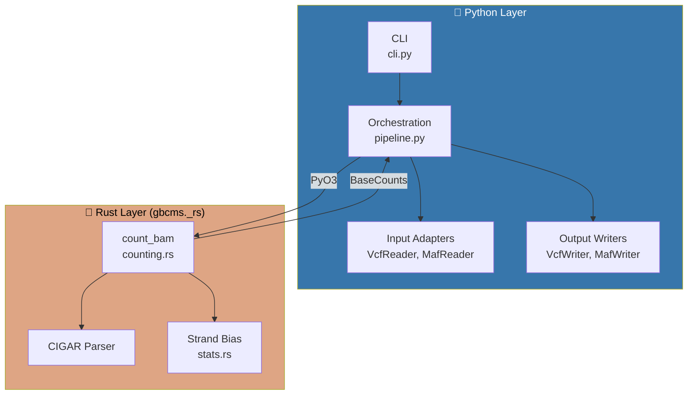
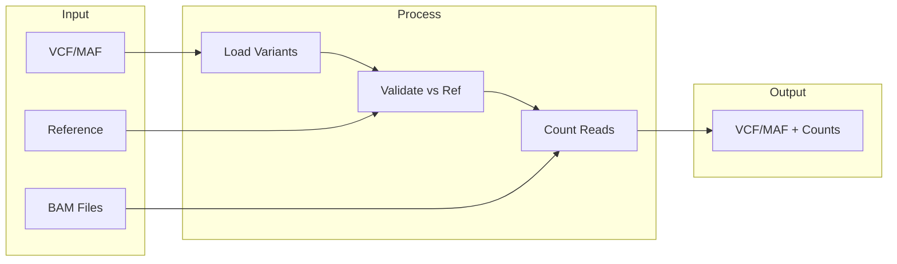
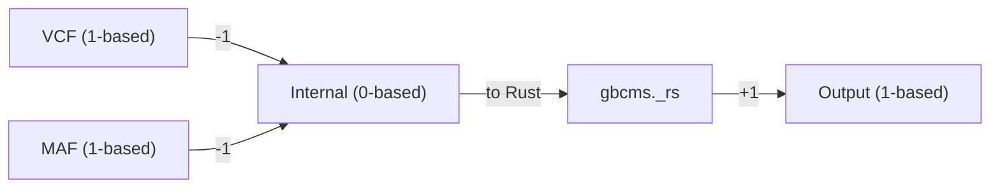
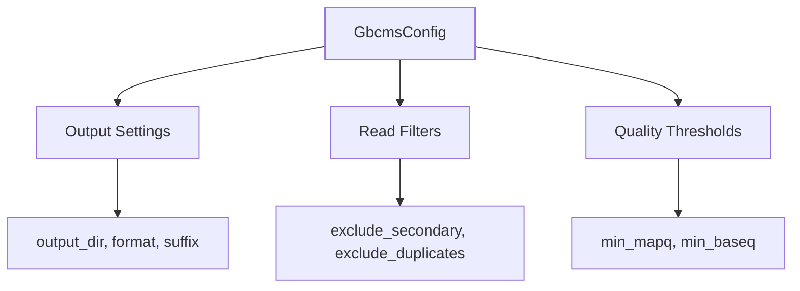

# Architecture

py-gbcms uses a hybrid Python/Rust architecture for maximum performance.

## System Overview



---

## Data Flow



---

## Coordinate System

All coordinates normalized to **0-based, half-open** internally:



| Format | System | Example |
|:-------|:-------|:--------|
| VCF input | 1-based | chr1:100 |
| Internal | 0-based | chr1:99 |
| Output | 1-based | chr1:100 |

---

## Formulas

### Variant Allele Frequency (VAF)

```
VAF = AD / (RD + AD)
```

Where:
- **AD** = Alternate allele read count
- **RD** = Reference allele read count

### Strand Bias (Fisher's Exact Test)

```
         |  Forward  Reverse  |
    -----+--------------------+
    Ref  |    a        b      |
    Alt  |    c        d      |
    -----+--------------------+
    
    p-value = Fisher's exact test on 2×2 contingency table
```

Low p-value (< 0.05) indicates potential strand bias artifact.

---

## Module Structure

```
src/gbcms/
├── cli.py           # Typer CLI
├── pipeline.py      # Orchestration
├── core/
│   └── kernel.py    # Coordinate normalization
├── io/
│   ├── input.py     # VcfReader, MafReader
│   └── output.py    # VcfWriter, MafWriter
├── models/
│   └── core.py      # Pydantic config
└── utils/
    └── logging.py   # Structured logging

rust/src/
├── lib.rs           # PyO3 module (_rs)
├── counting.rs      # BAM processing
├── stats.rs         # Fisher's exact test
└── types.rs         # Variant, BaseCounts
```

---

## Configuration

All settings via `GbcmsConfig` (Pydantic model):



See [models/core.py](file:///src/gbcms/models/core.py) for definitions.

## Related

- [Variant Counting](variant-counting.md) — How each variant type is counted
- [Input Formats](input-formats.md) — VCF and MAF specifications
- [Glossary](glossary.md) — Term definitions
