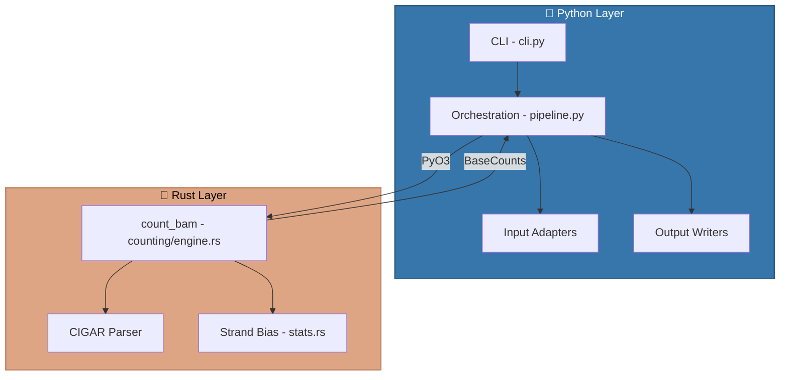
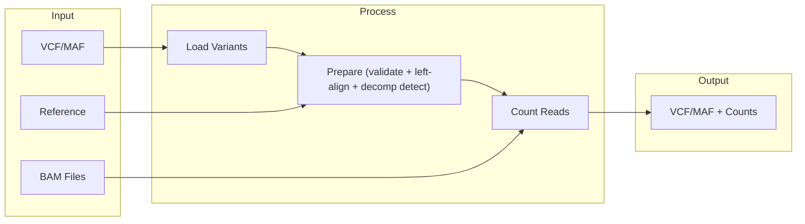
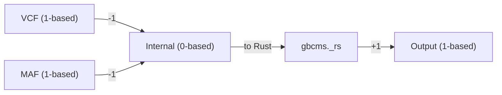
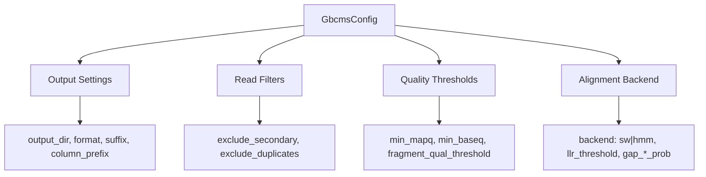
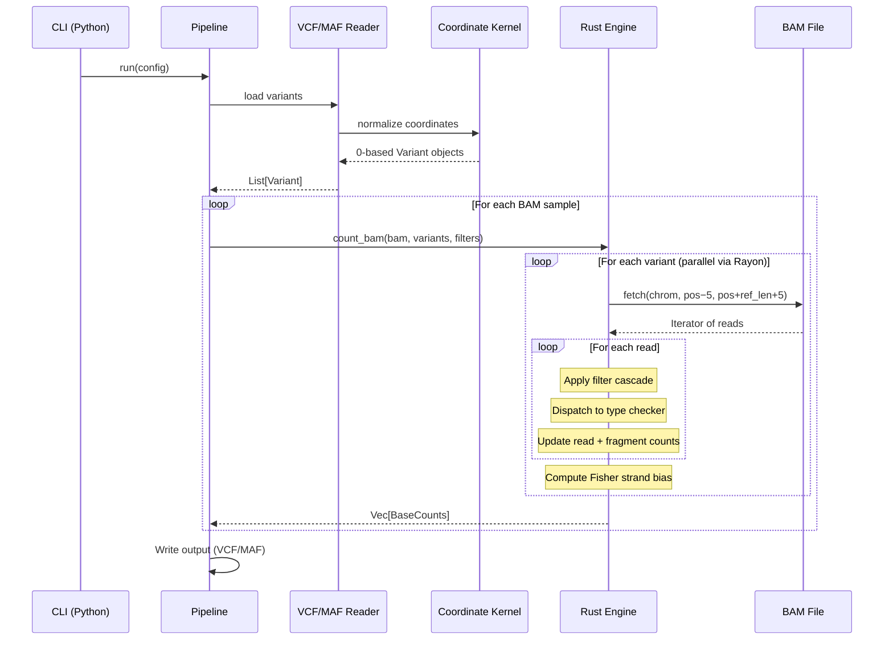

# Architecture

gbcms uses a hybrid Python/Rust architecture for maximum performance.

## System Overview


```mermaid
flowchart TB
    subgraph Python [🐍 Python Layer]
        CLI[CLI - cli.py] --> Pipeline[Orchestration - pipeline.py]
        Pipeline --> Reader[Input Adapters]
        Pipeline --> Writer[Output Writers]
    end
    
    subgraph Rust [🦀 Rust Layer]
        Counter[count_bam - counting/engine.rs] --> CIGAR[CIGAR Parser]
        Counter --> Stats[Strand Bias - stats.rs]
    end
    
    Pipeline -->|PyO3| Counter
    Counter -->|BaseCounts| Pipeline
    
    classDef pythonStyle fill:#3776ab,color:#fff,stroke:#2c5f8a,stroke-width:2px;
    classDef rustStyle fill:#dea584,color:#000,stroke:#c48a6a,stroke-width:2px;
    class Python pythonStyle;
    class Rust rustStyle;
```

---

## Data Flow


```mermaid
flowchart LR
    subgraph Input
        VCF[VCF/MAF]
        BAM[BAM Files]
        FASTA[Reference]
    end
    
    subgraph Process
        Load[Load Variants]
        Prepare["Prepare (validate + left-align + decomp detect)"]
        Count[Count Reads]
    end
    
    subgraph Output
        Result[VCF/MAF + Counts]
    end
    
    VCF --> Load --> Prepare
    FASTA --> Prepare
    Prepare --> Count
    BAM --> Count
    Count --> Result
```

---

## Coordinate System

All coordinates normalized to **0-based, half-open** internally:


```mermaid
flowchart LR
    VCF["VCF (1-based)"] -->|"-1"| Internal["Internal (0-based)"]
    MAF["MAF (1-based)"] -->|"-1"| Internal
    Internal -->|"to Rust"| Rust["gbcms._rs"]
    Rust -->|"+1"| Output["Output (1-based)"]
```

| Format | System | Example |
|:-------|:-------|:--------|
| VCF input | 1-based | chr1:100 |
| Internal | 0-based | chr1:99 |
| Output | 1-based | chr1:100 |

---

## Formulas

### Variant Allele Frequency (VAF)

```
VAF = AD / (RD + AD)
```

Where:
- **AD** = Alternate allele read count
- **RD** = Reference allele read count

### Strand Bias (Fisher's Exact Test)

```
         |  Forward  Reverse  |
    -----+--------------------+
    Ref  |    a        b      |
    Alt  |    c        d      |
    -----+--------------------+
    
    p-value = Fisher's exact test on 2×2 contingency table
```

Low p-value (< 0.05) indicates potential strand bias artifact.

---

## Module Structure

```
src/gbcms/
├── cli.py           # Typer CLI (~350 LOC)
├── pipeline.py      # Orchestration (~450 LOC)
├── normalize.py     # Standalone normalization workflow
├── core/
│   └── kernel.py    # Coordinate normalization
├── io/
│   ├── input.py     # VcfReader, MafReader
│   └── output.py    # VcfWriter, MafWriter
├── models/
│   └── core.py      # Pydantic config (GbcmsConfig, AlignmentConfig)
└── utils/
    └── logging.py   # Structured logging

rust/src/
├── lib.rs                    # PyO3 module exports
├── counting/
│   ├── mod.rs                # Submodule re-exports
│   ├── engine.rs             # Main loop, DP gating, read iteration (~950 LOC)
│   ├── variant_checks.rs     # check_snp/mnp/ins/del/complex (~1200 LOC)
│   ├── alignment.rs          # Smith-Waterman implementation (~350 LOC)
│   ├── pairhmm.rs            # PairHMM alignment backend (~520 LOC)
│   ├── fragment.rs           # FragmentEvidence, quality consensus
│   └── utils.rs              # Helpers, reconstruction, soft-clip
├── normalize/
│   ├── mod.rs                # Submodule re-exports
│   ├── engine.rs             # Normalization pipeline (~810 LOC)
│   ├── left_align.rs         # bcftools-style left-alignment
│   ├── decomp.rs             # Homopolymer decomposition
│   ├── fasta.rs              # Reference sequence fetcher
│   ├── repeat.rs             # Tandem repeat detection
│   └── types.rs              # NormResult enum
├── stats.rs                  # Fisher's exact test
└── types.rs                  # Variant, BaseCounts, PyO3 bindings
```

---

## Configuration

All settings via `GbcmsConfig` (Pydantic model):


```mermaid
flowchart TB
    GbcmsConfig --> OutputConfig[Output Settings]
    GbcmsConfig --> ReadFilters[Read Filters]
    GbcmsConfig --> QualityThresholds[Quality Thresholds]
    GbcmsConfig --> AlignmentConfig[Alignment Backend]
    
    OutputConfig --> D1[output_dir, format, suffix, column_prefix]
    ReadFilters --> D2[exclude_secondary, exclude_duplicates]
    QualityThresholds --> D3["min_mapq, min_baseq, fragment_qual_threshold"]
    AlignmentConfig --> D4["backend: sw|hmm, llr_threshold, gap_*_prob"]
```

See [models/core.py](file:///src/gbcms/models/core.py) for definitions.

---

## Full Pipeline: End-to-End Example

Here's how a single variant is processed through the complete pipeline:


```mermaid
sequenceDiagram
    participant CLI as CLI (Python)
    participant Pipeline as Pipeline
    participant Reader as VCF/MAF Reader
    participant Kernel as Coordinate Kernel
    participant Rust as Rust Engine
    participant BAM as BAM File

    CLI->>Pipeline: run(config)
    Pipeline->>Reader: load variants
    Reader->>Kernel: normalize coordinates
    Kernel-->>Reader: 0-based Variant objects
    Reader-->>Pipeline: List[Variant]

    loop For each BAM sample
        Pipeline->>Rust: count_bam(bam, variants, filters)
        loop For each variant (parallel via Rayon)
            Rust->>BAM: fetch(chrom, pos−5, pos+ref_len+5)
            BAM-->>Rust: Iterator of reads
            loop For each read
                Note over Rust: Apply filter cascade
                Note over Rust: Dispatch to type checker
                Note over Rust: Update read + fragment counts
            end
            Note over Rust: Compute Fisher strand bias
        end
        Rust-->>Pipeline: Vec[BaseCounts]
    end

    Pipeline->>Pipeline: Write output (VCF/MAF)
```

---

## Comparison with Original GBCMS

| Feature | Original GBCMS | gbcms |
|:--------|:---------------|:---------|
| Counting algorithm | Region-based chunking, position matching | Per-variant CIGAR traversal |
| Indel detection | Exact position match only | **Windowed scan** (±5bp) with 3-layer safeguards: sequence identity, closest match, reference context validation |
| Complex variants | Optional via `--generic_counting` | Always uses haplotype reconstruction |
| Complex quality handling | Exact match only (no quality awareness) | **Masked comparison** — bases below `--min-baseq` are masked out, ambiguity detection prevents false positives |
| Base quality filtering | No base quality threshold | Default `--min-baseq 20` (Phred Q20) |
| MNP handling | Not explicit | Dedicated `check_mnp` with contiguity check |
| Fragment counting | Optional (`--fragment_count`), majority-rule | Always computed, quality-weighted consensus with discard |
| Positive strand counts | Optional (`--positive_count`) | Always computed |
| Strand bias | Not computed | Fisher's exact test (read + fragment level) |
| Fractional depth | `--fragment_fractional_weight` | Not implemented |
| Parallelism | OpenMP block-based | Rayon per-variant |

---

## Related

- [Allele Classification](allele-classification.md) — How each variant type is counted
- [Variant Normalization](variant-normalization.md) — How variants are prepared before counting
- [Input Formats](input-formats.md) — VCF and MAF specifications
- [Glossary](glossary.md) — Term definitions
