# Architecture

py-gbcms uses a hybrid Python/Rust architecture for maximum performance.

## System Overview


---

## Data Flow


---

## Coordinate System

All coordinates normalized to **0-based, half-open** internally:


| Format | System | Example |
|:-------|:-------|:--------|
| VCF input | 1-based | chr1:100 |
| Internal | 0-based | chr1:99 |
| Output | 1-based | chr1:100 |

---

## Formulas

### Variant Allele Frequency (VAF)

```
VAF = AD / (RD + AD)
```

Where:
- **AD** = Alternate allele read count
- **RD** = Reference allele read count

### Strand Bias (Fisher's Exact Test)

```
         |  Forward  Reverse  |
    -----+--------------------+
    Ref  |    a        b      |
    Alt  |    c        d      |
    -----+--------------------+
    
    p-value = Fisher's exact test on 2×2 contingency table
```

Low p-value (< 0.05) indicates potential strand bias artifact.

---

## Module Structure

```
src/gbcms/
├── cli.py           # Typer CLI
├── pipeline.py      # Orchestration
├── normalize.py     # Standalone normalization workflow
├── core/
│   └── kernel.py    # Coordinate normalization
├── io/
│   ├── input.py     # VcfReader, MafReader
│   └── output.py    # VcfWriter, MafWriter
├── models/
│   └── core.py      # Pydantic config
└── utils/
    └── logging.py   # Structured logging

rust/src/
├── lib.rs           # PyO3 module (_rs)
├── counting.rs      # BAM processing, FragmentEvidence, dual-counting
├── normalize.rs     # Variant preparation, left-alignment, homopolymer detection
├── stats.rs         # Fisher's exact test
└── types.rs         # Variant, BaseCounts
```

---

## Configuration

All settings via `GbcmsConfig` (Pydantic model):


See [models/core.py](file:///src/gbcms/models/core.py) for definitions.

---

## Full Pipeline: End-to-End Example

Here's how a single variant is processed through the complete pipeline:

```mermaid
sequenceDiagram
    participant CLI as CLI (Python)
    participant Pipeline as Pipeline
    participant Reader as VCF/MAF Reader
    participant Kernel as Coordinate Kernel
    participant Rust as Rust Engine
    participant BAM as BAM File

    CLI->>Pipeline: run(config)
    Pipeline->>Reader: load variants
    Reader->>Kernel: normalize coordinates
    Kernel-->>Reader: 0-based Variant objects
    Reader-->>Pipeline: List[Variant]

    loop For each BAM sample
        Pipeline->>Rust: count_bam(bam, variants, filters)
        loop For each variant (parallel via Rayon)
            Rust->>BAM: fetch(chrom, pos−5, pos+ref_len+5)
            BAM-->>Rust: Iterator of reads
            loop For each read
                Note over Rust: Apply filter cascade
                Note over Rust: Dispatch to type checker
                Note over Rust: Update read + fragment counts
            end
            Note over Rust: Compute Fisher strand bias
        end
        Rust-->>Pipeline: Vec[BaseCounts]
    end

    Pipeline->>Pipeline: Write output (VCF/MAF)
```



---

## Comparison with Original GBCMS

| Feature | Original GBCMS | py-gbcms |
|:--------|:---------------|:---------|
| Counting algorithm | Region-based chunking, position matching | Per-variant CIGAR traversal |
| Indel detection | Exact position match only | **Windowed scan** (±5bp) with 3-layer safeguards: sequence identity, closest match, reference context validation |
| Complex variants | Optional via `--generic_counting` | Always uses haplotype reconstruction |
| Complex quality handling | Exact match only (no quality awareness) | **Masked comparison** — bases below `--min-baseq` are masked out, ambiguity detection prevents false positives |
| Base quality filtering | No base quality threshold | Default `--min-baseq 20` (Phred Q20) |
| MNP handling | Not explicit | Dedicated `check_mnp` with contiguity check |
| Fragment counting | Optional (`--fragment_count`), majority-rule | Always computed, quality-weighted consensus with discard |
| Positive strand counts | Optional (`--positive_count`) | Always computed |
| Strand bias | Not computed | Fisher's exact test (read + fragment level) |
| Fractional depth | `--fragment_fractional_weight` | Not implemented |
| Parallelism | OpenMP block-based | Rayon per-variant |

---

## Related

- [Allele Classification](allele-classification.md) — How each variant type is counted
- [Variant Normalization](variant-normalization.md) — How variants are prepared before counting
- [Input Formats](input-formats.md) — VCF and MAF specifications
- [Glossary](glossary.md) — Term definitions
