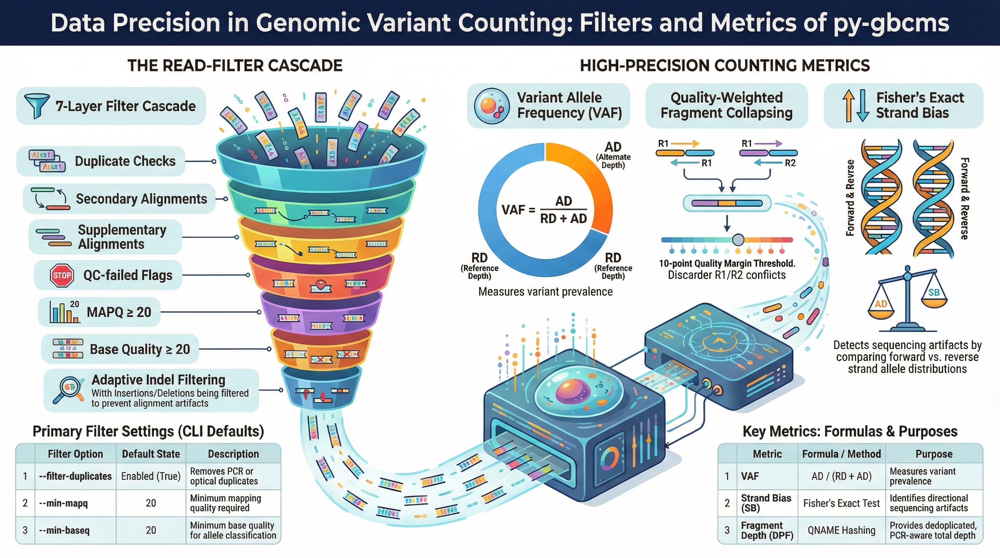
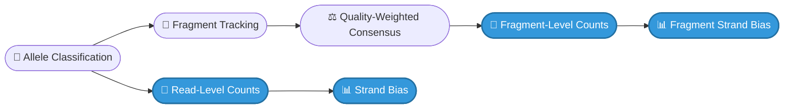
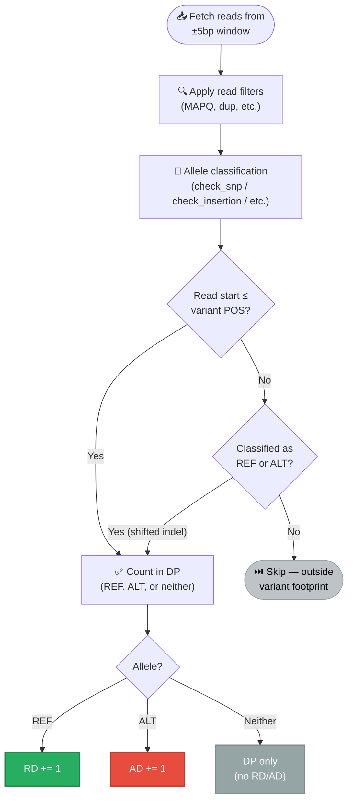
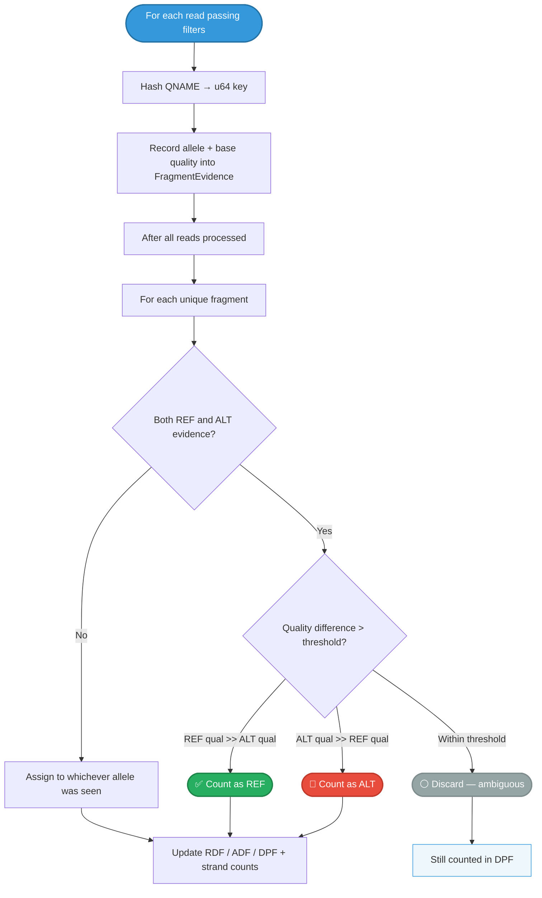
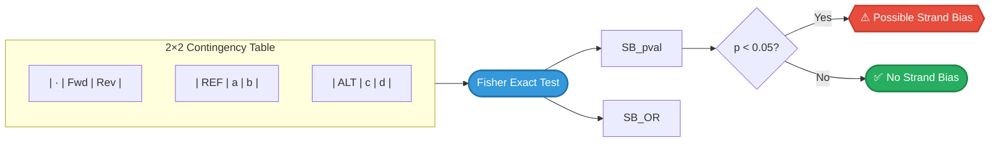

# Counting & Metrics

How allele classifications become counts — read-level metrics, fragment counting, strand bias, and output columns.

!!! info "Visual Overview"
    <figure markdown="span">
      { loading=lazy width="100%" }
      <figcaption>The read-filter cascade and counting metrics — click to enlarge</figcaption>
    </figure>

## Overview

After each read is [classified](allele-classification.md) as REF, ALT, or neither, gbcms accumulates counts at **two levels**: individual reads and collapsed fragments. It then computes strand bias statistics using Fisher's exact test.


```mermaid
flowchart LR
    Class([🧬 Allele Classification]) --> ReadCount([📖 Read-Level Counts])
    Class --> FragTrack([🔗 Fragment Tracking])
    FragTrack --> Consensus([⚖️ Quality-Weighted Consensus])
    Consensus --> FragCount([🧬 Fragment-Level Counts])
    ReadCount --> SB([📊 Strand Bias])
    FragCount --> FSB([📊 Fragment Strand Bias])

    classDef metrics fill:#3498db,color:#fff,stroke:#2471a3,stroke-width:2px;
    class ReadCount,FragCount,SB,FSB metrics;
```

---

## Read-Level Counting

Each read passing filters is counted independently. No deduplication is applied at this level.


```mermaid
flowchart TD
    Fetch(["📥 Fetch reads from<br/>±5bp window"]) --> Filters["🔍 Apply read filters<br/>(MAPQ, dup, etc.)"]
    Filters --> Classify["🧬 Allele classification<br/>(check_snp / check_insertion / etc.)"]
    Classify --> Anchor{"Read start ≤<br/>variant POS?"}
    Anchor -->|"Yes"| DP["✅ Count in DP<br/>(REF, ALT, or neither)"]
    Anchor -->|"No"| ClassCheck{"Classified as<br/>REF or ALT?"}
    ClassCheck -->|"Yes (shifted indel)"| DP
    ClassCheck -->|"No"| Skip(["⏭️ Skip — outside<br/>variant footprint"]):::skip
    DP --> Allele{"Allele?"}
    Allele -->|REF| RD["RD += 1"]:::ref
    Allele -->|ALT| AD["AD += 1"]:::alt
    Allele -->|Neither| Neither["DP only<br/>(no RD/AD)"]:::neither

    classDef ref fill:#27ae60,color:#fff,stroke:#1e8449,stroke-width:2px;
    classDef alt fill:#e74c3c,color:#fff,stroke:#c0392b,stroke-width:2px;
    classDef neither fill:#95a5a6,color:#fff,stroke:#7f8c8d,stroke-width:2px;
    classDef skip fill:#bdc3c7,color:#000,stroke:#95a5a6;
```


!!! info "Anchor Overlap Standard"
    DP gating uses **single-position** anchor overlap: `read_start ≤ variant.pos`. This matches the depth definition used by Mutect2, VarDictJava, and `samtools mpileup` — depth is measured at the variant position, not across the entire REF allele span. Reads fetched from the wider ±5bp window that don't overlap the anchor are excluded from DP unless classified as REF/ALT via shifted indel detection.

### Read Metrics

| Metric | Description |
|:-------|:------------|
| **DP** | Total depth — **all** mapped, quality-filtered reads whose alignment start ≤ variant POS, regardless of allele classification. Includes reads that are neither REF nor ALT (e.g., third alleles at multi-allelic sites). `DP ≥ RD + AD`. |
| **RD** / **AD** | Reference / Alternate read counts |
| **DP_fwd** / **DP_rev** | Strand-specific total depth |
| **RD_fwd** / **RD_rev** | Strand-specific reference counts |
| **AD_fwd** / **AD_rev** | Strand-specific alternate counts |

---

## Fragment Counting

Fragment counting collapses read pairs into a single observation per fragment. This is critical for **cfDNA sequencing** (like MSK-ACCESS) where the same DNA fragment is sequenced from both ends — counting reads would double-count each fragment.

### Fragment Tracking

Fragments are tracked using **QNAME hashing** — each read's QNAME is hashed to a `u64` key for memory-efficient lookup. The `FragmentEvidence` struct records the best base quality seen for REF and ALT across both reads in the pair.


```mermaid
flowchart TD
    Start([For each read passing filters]):::start
    Start --> Hash["Hash QNAME → u64 key"]
    Hash --> Observe["Record allele + base quality into FragmentEvidence"]
    Observe --> Done[After all reads processed]
    Done --> ForEach[For each unique fragment]
    ForEach --> HasBoth{Both REF and ALT evidence?}
    HasBoth -->|No| Direct[Assign to whichever allele was seen]
    HasBoth -->|Yes| QualCheck{"Quality difference > threshold?"}
    QualCheck -->|"REF qual >> ALT qual"| Ref([✅ Count as REF]):::ref
    QualCheck -->|"ALT qual >> REF qual"| Alt([🔴 Count as ALT]):::alt
    QualCheck -->|"Within threshold"| Discard([⚪ Discard — ambiguous]):::discard
    Direct --> Count
    Ref --> Count
    Alt --> Count
    Discard --> DPF["Still counted in DPF"]:::info
    Count[Update RDF / ADF / DPF + strand counts]

    classDef start fill:#3498db,color:#fff,stroke:#2471a3,stroke-width:2px;
    classDef ref fill:#27ae60,color:#fff,stroke:#1e8449,stroke-width:2px;
    classDef alt fill:#e74c3c,color:#fff,stroke:#c0392b,stroke-width:2px;
    classDef discard fill:#95a5a6,color:#fff,stroke:#7f8c8d,stroke-width:2px;
    classDef info fill:#3498db15,stroke:#3498db;
```

### Quality-Weighted Consensus

When R1 and R2 of a fragment **disagree** (one supports REF, the other ALT), the engine resolves the conflict using base quality scores:

| Scenario | Condition | Result |
|:---------|:----------|:-------|
| **REF wins** | `best_ref_qual > best_alt_qual + threshold` | Count as REF |
| **ALT wins** | `best_alt_qual > best_ref_qual + threshold` | Count as ALT |
| **Ambiguous** | Quality difference ≤ threshold | **Discard** (neither REF nor ALT) |

The threshold is configurable via `--fragment-qual-threshold` (default: **10**).

!!! important "Why Discard Instead of Defaulting to REF?"
    Assigning ambiguous fragments to REF would systematically **deflate VAF** by inflating the reference count. In cfDNA sequencing where true variants can be at 0.1–1% VAF, this bias could mask real mutations. Discarding preserves an unbiased VAF estimate at the cost of slightly reduced power.

### Fragment Orientation

Fragment strand is determined by **read 1 orientation** (preferred) or read 2 if read 1 is not available. This is consistent with standard library preparation conventions.

### Fragment Metrics

| Metric | Description |
|:-------|:------------|
| **DPF** | Fragment depth — all unique fragments (including discarded) |
| **RDF** / **ADF** | Reference / Alternate fragment counts (resolved only) |
| **RDF_fwd** / **RDF_rev** | Strand-specific reference fragment counts |
| **ADF_fwd** / **ADF_rev** | Strand-specific alternate fragment counts |

!!! tip "Quality Signal: DPF − (RDF + ADF)"
    Discarded fragments are counted in **DPF** but not in RDF or ADF. The gap `DPF − (RDF + ADF)` reveals how many ambiguous fragments exist — a useful quality metric. A large gap suggests a noisy or error-prone site.

---

## VAF Calculation

```
VAF = AD / (RD + AD)
```

Where **AD** and **RD** are the read-level alternate and reference counts. Fragment-level VAF can be similarly computed as `ADF / (RDF + ADF)`.

---

## Strand Bias (Fisher's Exact Test)

Strand bias detects when an allele is disproportionately supported by reads on one strand — a common sequencing artifact.


```mermaid
flowchart LR
    subgraph Table ["2×2 Contingency Table"]
        direction TB
        Header["| · | Fwd | Rev |"]
        RefRow["| REF | a | b |"]
        AltRow["| ALT | c | d |"]
    end

    Table --> Fisher([Fisher Exact Test]):::test
    Fisher --> Pval[SB_pval]
    Fisher --> OR[SB_OR]

    Pval --> Interpret{p < 0.05?}
    Interpret -->|Yes| Bias{{⚠️ Possible Strand Bias}}:::warn
    Interpret -->|No| NoBias([✅ No Strand Bias]):::pass

    classDef test fill:#3498db,color:#fff,stroke:#2471a3,stroke-width:2px;
    classDef warn fill:#e74c3c,color:#fff,stroke:#c0392b,stroke-width:2px;
    classDef pass fill:#27ae60,color:#fff,stroke:#1e8449,stroke-width:2px;
```

Computed at **both** levels:

| Metric | Level | Description |
|:-------|:------|:------------|
| **SB_pval** / **SB_OR** | Read | Strand bias from individual reads |
| **FSB_pval** / **FSB_OR** | Fragment | Strand bias from collapsed fragments |

!!! warning "Paired-End Data: Use FSB, Not SB"
    For paired-end sequencing (e.g., MSK-ACCESS), R1 and R2 from the same fragment are **not** independent observations. Read-level SB (`SB_pval`) artificially doubles the sample size N in the Fisher's test contingency table, producing deflated p-values that can falsely flag true variants as strand bias artifacts. **Clinical filtering pipelines should use `FSB_pval`** (fragment-level), which correctly treats each physical fragment as a single independent observation.

!!! example "Strand Bias Example"
    If a variant has `AD_fwd=15, AD_rev=1`, that's suspicious — almost all ALT-supporting reads are on the forward strand. Fisher's test would yield a low p-value, flagging this as a potential artifact.

---

## Complete Output Column Reference

All fields in the `BaseCounts` struct returned by `count_bam()`:

| Column | Type | Description |
|:-------|:-----|:------------|
| `dp` | u32 | Total read depth — reads overlapping the variant anchor position, including 'neither' reads |
| `rd` | u32 | Reference read count |
| `ad` | u32 | Alternate read count |
| `dp_fwd` / `dp_rev` | u32 | Strand-specific total depth |
| `rd_fwd` / `rd_rev` | u32 | Strand-specific reference counts |
| `ad_fwd` / `ad_rev` | u32 | Strand-specific alternate counts |
| `dpf` | u32 | Fragment depth (all fragments) |
| `rdf` | u32 | Reference fragment count |
| `adf` | u32 | Alternate fragment count |
| `rdf_fwd` / `rdf_rev` | u32 | Strand-specific reference fragment counts |
| `adf_fwd` / `adf_rev` | u32 | Strand-specific alternate fragment counts |
| `sb_pval` | f64 | Read-level strand bias p-value |
| `sb_or` | f64 | Read-level strand bias odds ratio |
| `fsb_pval` | f64 | Fragment-level strand bias p-value |
| `fsb_or` | f64 | Fragment-level strand bias odds ratio |
| `used_decomposed` | bool | True if corrected homopolymer allele was used |

---

## mFSD — Mutant Fragment Size Distribution {#mfsd}

mFSD compares insert-size distributions for **REF-classified** vs **ALT-classified** fragments at each variant position. Short-fragment enrichment in the ALT class indicates tumor-derived cfDNA.

Enabled with `--mfsd`. All 34 columns (and their VCF INFO equivalents) are absent from output without this flag.

### Fragment Classes

| Class | Definition |
|:------|:-----------|
| `REF` | Fragment supporting the reference allele, valid insert size (50–1000 bp) |
| `ALT` | Fragment supporting the alternate allele, valid insert size |
| `NonREF` | Fragment supporting a third allele (neither REF nor ALT) |
| `N` | Fragment where the base at the variant position was called `N` |

### MAF Columns (34 total)

#### Raw Counts

| Column | Description |
|:-------|:------------|
| `mfsd_ref_count` | Fragments classified REF with valid insert size |
| `mfsd_alt_count` | Fragments classified ALT with valid insert size |
| `mfsd_nonref_count` | Fragments classified as a third allele |
| `mfsd_n_count` | Fragments with base `N` at the variant position |

#### Log-Likelihood Ratios

| Column | Description |
|:-------|:------------|
| `mfsd_alt_llr` | LLR for ALT fragments: Σ log(P_tumor/P_healthy). Positive = tumor-like (short fragments). |
| `mfsd_ref_llr` | LLR for REF fragments |

#### Mean Fragment Sizes

| Column | Description |
|:-------|:------------|
| `mfsd_ref_mean` | Mean insert size (bp) for REF fragments. `NA` when class is empty. |
| `mfsd_alt_mean` | Mean insert size (bp) for ALT fragments |
| `mfsd_nonref_mean` | Mean insert size (bp) for NonREF fragments |
| `mfsd_n_mean` | Mean insert size (bp) for N fragments |

#### Pairwise KS Statistics (6 pairs × 3 values = 18 columns)

Each pair yields: `delta` (mean difference in bp), `ks` (KS D-statistic), `pval` (KS p-value).
Values are `NA` when either class has fewer than 5 fragments (`mfsd_ks_valid = False`).

| Pairs |
|:------|
| ALT vs REF: `mfsd_delta_alt_ref`, `mfsd_ks_alt_ref`, `mfsd_pval_alt_ref` |
| ALT vs NonREF: `mfsd_delta_alt_nonref`, `mfsd_ks_alt_nonref`, `mfsd_pval_alt_nonref` |
| REF vs NonREF: `mfsd_delta_ref_nonref`, `mfsd_ks_ref_nonref`, `mfsd_pval_ref_nonref` |
| ALT vs N: `mfsd_delta_alt_n`, `mfsd_ks_alt_n`, `mfsd_pval_alt_n` |
| REF vs N: `mfsd_delta_ref_n`, `mfsd_ks_ref_n`, `mfsd_pval_ref_n` |
| NonREF vs N: `mfsd_delta_nonref_n`, `mfsd_ks_nonref_n`, `mfsd_pval_nonref_n` |

#### Derived Metrics

| Column | Description |
|:-------|:------------|
| `mfsd_error_rate` | NonREF / total_mFSD fragments. `NA` when total = 0. |
| `mfsd_n_rate` | N / total_mFSD fragments. `NA` when total = 0. |
| `mfsd_size_ratio` | mean(ALT) / mean(REF). `NA` when REF mean = 0 or ALT count = 0. |
| `mfsd_quality_score` | 1 − error_rate − n_rate. `NA` when either rate is `NA`. |
| `mfsd_alt_confidence` | `HIGH` (≥5 ALT frags), `LOW` (1–4), `NONE` (0) |
| `mfsd_ks_valid` | `True` when both ALT and REF have ≥5 fragments |

### VCF INFO Fields (7 total)

Added to `##INFO` header and per-variant INFO column when `--mfsd` is set.

| INFO key | Type | Description |
|:---------|:-----|:------------|
| `MFSD_DELTA_ALT_REF` | Float | mean(ALT) − mean(REF) in bp |
| `MFSD_KS_ALT_REF` | Float | KS D-statistic (ALT vs REF) |
| `MFSD_PVAL_ALT_REF` | Float | KS p-value (ALT vs REF) |
| `MFSD_ALT_LLR` | Float | LLR for ALT fragments |
| `MFSD_REF_LLR` | Float | LLR for REF fragments |
| `MFSD_ALT_COUNT` | Integer | ALT-classified fragment count |
| `MFSD_REF_COUNT` | Integer | REF-classified fragment count |

### Parquet Output (--mfsd-parquet)

When `--mfsd-parquet` is also set, a companion `<sample>.fsd.parquet` is written with raw arrays:

| Column | Type | Description |
|:-------|:-----|:------------|
| `chrom` | String | Chromosome |
| `pos` | Int64 | 1-based position |
| `ref` | String | Reference allele |
| `alt` | String | Alternate allele |
| `ref_sizes` | List\<Int32\> | Insert sizes (bp) of all REF fragments |
| `alt_sizes` | List\<Int32\> | Insert sizes (bp) of all ALT fragments |

Written natively by the Rust engine (no `pyarrow` dependency).

---

## Comparison with Original GBCMS

| Feature | Original GBCMS | gbcms |
|:--------|:---------------|:---------|
| Counting algorithm | Region-based chunking, position matching | Per-variant CIGAR traversal |
| Indel detection | Exact position match only | **Windowed scan** (±5bp) with 3-layer safeguards |
| Complex variants | Optional via `--generic_counting` | Always uses haplotype reconstruction |
| Complex quality handling | Exact match only | **Masked comparison** — unreliable bases excluded |
| Base quality filtering | No threshold | Default `--min-baseq 20` |
| MNP handling | Not explicit | Dedicated `check_mnp` with contiguity check |
| Fragment counting | Optional (`--fragment_count`), majority-rule | Always computed, quality-weighted consensus |
| Positive strand counts | Optional (`--positive_count`) | Always computed |
| Strand bias | Not computed | Fisher's exact test (read + fragment level) |
| Fractional depth | `--fragment_fractional_weight` | Not implemented |
| Parallelism | OpenMP block-based | Rayon per-variant |

---

## Related

- [Allele Classification](allele-classification.md) — How reads are classified
- [Read Filters](read-filters.md) — Which reads reach counting
- [Architecture](architecture.md) — System design
- [Glossary](glossary.md) — Term definitions
