# Counting & Metrics

How allele classifications become counts — read-level metrics, fragment counting, strand bias, and output columns.

!!! info "Visual Overview"
    <figure markdown="span">
      { loading=lazy width="100%" }
      <figcaption>The read-filter cascade and counting metrics — click to enlarge</figcaption>
    </figure>

## Overview

After each read is [classified](allele-classification.md) as REF, ALT, or neither, py-gbcms accumulates counts at **two levels**: individual reads and collapsed fragments. It then computes strand bias statistics using Fisher's exact test.

```mermaid
flowchart LR
    Class([🧬 Allele Classification]) --> ReadCount([📖 Read-Level Counts])
    Class --> FragTrack([🔗 Fragment Tracking])
    FragTrack --> Consensus([⚖️ Quality-Weighted Consensus])
    Consensus --> FragCount([🧬 Fragment-Level Counts])
    ReadCount --> SB([📊 Strand Bias])
    FragCount --> FSB([📊 Fragment Strand Bias])

    classDef metrics fill:#3498db,color:#fff,stroke:#2471a3,stroke-width:2px;
    class ReadCount,FragCount,SB,FSB metrics;
```



---

## Read-Level Counting

Each read passing filters is counted independently. No deduplication is applied at this level.

```mermaid
flowchart TD
    subgraph ReadLevel ["📖 Read-Level Counting"]
        R1[Read 1 fwd → ALT]:::altread
        R2[Read 2 rev → ALT]:::altread
        R3[Read 3 fwd → REF]:::refread
        R4[Read 4 rev → REF]:::refread
        R5[Read 5 fwd → ALT]:::altread
        R6[Read 6 rev → REF]:::refread
    end

    subgraph Results ["📊 Read Counts"]
        Counts["DP=6  RD=3  AD=3<br/>DP_fwd=3  DP_rev=3<br/>RD_fwd=1  RD_rev=2<br/>AD_fwd=2  AD_rev=1"]
    end

    R1 --> Results
    R2 --> Results
    R3 --> Results
    R4 --> Results
    R5 --> Results
    R6 --> Results

    classDef altread fill:#e74c3c15,stroke:#e74c3c;
    classDef refread fill:#27ae6015,stroke:#27ae60;
```



### Read Metrics

| Metric | Description |
|:-------|:------------|
| **DP** | Total depth (reads supporting REF or ALT) |
| **RD** / **AD** | Reference / Alternate read counts |
| **DP_fwd** / **DP_rev** | Strand-specific total depth |
| **RD_fwd** / **RD_rev** | Strand-specific reference counts |
| **AD_fwd** / **AD_rev** | Strand-specific alternate counts |

---

## Fragment Counting

Fragment counting collapses read pairs into a single observation per fragment. This is critical for **cfDNA sequencing** (like MSK-ACCESS) where the same DNA fragment is sequenced from both ends — counting reads would double-count each fragment.

### Fragment Tracking

Fragments are tracked using **QNAME hashing** — each read's QNAME is hashed to a `u64` key for memory-efficient lookup. The `FragmentEvidence` struct records the best base quality seen for REF and ALT across both reads in the pair.

```mermaid
flowchart TD
    Start([For each read passing filters]):::start
    Start --> Hash["Hash QNAME → u64 key"]
    Hash --> Observe["Record allele + base quality into FragmentEvidence"]
    Observe --> Done[After all reads processed]
    Done --> ForEach[For each unique fragment]
    ForEach --> HasBoth{Both REF and ALT evidence?}
    HasBoth -->|No| Direct[Assign to whichever allele was seen]
    HasBoth -->|Yes| QualCheck{"Quality difference > threshold?"}
    QualCheck -->|"REF qual >> ALT qual"| Ref([✅ Count as REF]):::ref
    QualCheck -->|"ALT qual >> REF qual"| Alt([🔴 Count as ALT]):::alt
    QualCheck -->|"Within threshold"| Discard([⚪ Discard — ambiguous]):::discard
    Direct --> Count
    Ref --> Count
    Alt --> Count
    Discard --> DPF["Still counted in DPF"]:::info
    Count[Update RDF / ADF / DPF + strand counts]

    classDef start fill:#3498db,color:#fff,stroke:#2471a3,stroke-width:2px;
    classDef ref fill:#27ae60,color:#fff,stroke:#1e8449,stroke-width:2px;
    classDef alt fill:#e74c3c,color:#fff,stroke:#c0392b,stroke-width:2px;
    classDef discard fill:#95a5a6,color:#fff,stroke:#7f8c8d,stroke-width:2px;
    classDef info fill:#3498db15,stroke:#3498db;
```



### Quality-Weighted Consensus

When R1 and R2 of a fragment **disagree** (one supports REF, the other ALT), the engine resolves the conflict using base quality scores:

| Scenario | Condition | Result |
|:---------|:----------|:-------|
| **REF wins** | `best_ref_qual > best_alt_qual + threshold` | Count as REF |
| **ALT wins** | `best_alt_qual > best_ref_qual + threshold` | Count as ALT |
| **Ambiguous** | Quality difference ≤ threshold | **Discard** (neither REF nor ALT) |

The threshold is configurable via `--fragment-qual-threshold` (default: **10**).

!!! important "Why Discard Instead of Defaulting to REF?"
    Assigning ambiguous fragments to REF would systematically **deflate VAF** by inflating the reference count. In cfDNA sequencing where true variants can be at 0.1–1% VAF, this bias could mask real mutations. Discarding preserves an unbiased VAF estimate at the cost of slightly reduced power.

### Fragment Orientation

Fragment strand is determined by **read 1 orientation** (preferred) or read 2 if read 1 is not available. This is consistent with standard library preparation conventions.

### Fragment Metrics

| Metric | Description |
|:-------|:------------|
| **DPF** | Fragment depth — all unique fragments (including discarded) |
| **RDF** / **ADF** | Reference / Alternate fragment counts (resolved only) |
| **RDF_fwd** / **RDF_rev** | Strand-specific reference fragment counts |
| **ADF_fwd** / **ADF_rev** | Strand-specific alternate fragment counts |

!!! tip "Quality Signal: DPF − (RDF + ADF)"
    Discarded fragments are counted in **DPF** but not in RDF or ADF. The gap `DPF − (RDF + ADF)` reveals how many ambiguous fragments exist — a useful quality metric. A large gap suggests a noisy or error-prone site.

---

## VAF Calculation

```
VAF = AD / (RD + AD)
```

Where **AD** and **RD** are the read-level alternate and reference counts. Fragment-level VAF can be similarly computed as `ADF / (RDF + ADF)`.

---

## Strand Bias (Fisher's Exact Test)

Strand bias detects when an allele is disproportionately supported by reads on one strand — a common sequencing artifact.

```mermaid
flowchart LR
    subgraph Table ["2×2 Contingency Table"]
        direction TB
        Header["| · | Fwd | Rev |"]
        RefRow["| REF | a | b |"]
        AltRow["| ALT | c | d |"]
    end

    Table --> Fisher([Fisher Exact Test]):::test
    Fisher --> Pval[SB_pval]
    Fisher --> OR[SB_OR]

    Pval --> Interpret{p < 0.05?}
    Interpret -->|Yes| Bias{{⚠️ Possible Strand Bias}}:::warn
    Interpret -->|No| NoBias([✅ No Strand Bias]):::pass

    classDef test fill:#3498db,color:#fff,stroke:#2471a3,stroke-width:2px;
    classDef warn fill:#e74c3c,color:#fff,stroke:#c0392b,stroke-width:2px;
    classDef pass fill:#27ae60,color:#fff,stroke:#1e8449,stroke-width:2px;
```



Computed at **both** levels:

| Metric | Level | Description |
|:-------|:------|:------------|
| **SB_pval** / **SB_OR** | Read | Strand bias from individual reads |
| **FSB_pval** / **FSB_OR** | Fragment | Strand bias from collapsed fragments |

!!! example "Strand Bias Example"
    If a variant has `AD_fwd=15, AD_rev=1`, that's suspicious — almost all ALT-supporting reads are on the forward strand. Fisher's test would yield a low p-value, flagging this as a potential artifact.

---

## Complete Output Column Reference

All fields in the `BaseCounts` struct returned by `count_bam()`:

| Column | Type | Description |
|:-------|:-----|:------------|
| `dp` | u32 | Total read depth |
| `rd` | u32 | Reference read count |
| `ad` | u32 | Alternate read count |
| `dp_fwd` / `dp_rev` | u32 | Strand-specific total depth |
| `rd_fwd` / `rd_rev` | u32 | Strand-specific reference counts |
| `ad_fwd` / `ad_rev` | u32 | Strand-specific alternate counts |
| `dpf` | u32 | Fragment depth (all fragments) |
| `rdf` | u32 | Reference fragment count |
| `adf` | u32 | Alternate fragment count |
| `rdf_fwd` / `rdf_rev` | u32 | Strand-specific reference fragment counts |
| `adf_fwd` / `adf_rev` | u32 | Strand-specific alternate fragment counts |
| `sb_pval` | f64 | Read-level strand bias p-value |
| `sb_or` | f64 | Read-level strand bias odds ratio |
| `fsb_pval` | f64 | Fragment-level strand bias p-value |
| `fsb_or` | f64 | Fragment-level strand bias odds ratio |
| `used_decomposed` | bool | True if corrected homopolymer allele was used |

---

## Comparison with Original GBCMS

| Feature | Original GBCMS | py-gbcms |
|:--------|:---------------|:---------|
| Counting algorithm | Region-based chunking, position matching | Per-variant CIGAR traversal |
| Indel detection | Exact position match only | **Windowed scan** (±5bp) with 3-layer safeguards |
| Complex variants | Optional via `--generic_counting` | Always uses haplotype reconstruction |
| Complex quality handling | Exact match only | **Masked comparison** — unreliable bases excluded |
| Base quality filtering | No threshold | Default `--min-baseq 20` |
| MNP handling | Not explicit | Dedicated `check_mnp` with contiguity check |
| Fragment counting | Optional (`--fragment_count`), majority-rule | Always computed, quality-weighted consensus |
| Positive strand counts | Optional (`--positive_count`) | Always computed |
| Strand bias | Not computed | Fisher's exact test (read + fragment level) |
| Fractional depth | `--fragment_fractional_weight` | Not implemented |
| Parallelism | OpenMP block-based | Rayon per-variant |

---

## Related

- [Allele Classification](allele-classification.md) — How reads are classified
- [Read Filters](read-filters.md) — Which reads reach counting
- [Architecture](architecture.md) — System design
- [Glossary](glossary.md) — Term definitions
