# Input Formats

py-gbcms accepts VCF and MAF files as variant input.

## VCF (Variant Call Format)

Standard VCF format with required fields:

```
#CHROM  POS     ID      REF     ALT     QUAL    FILTER  INFO
chr1    12345   .       A       T       .       PASS    .
chr2    67890   .       G       C       .       PASS    .
```

### Requirements

- Tab-separated
- `#CHROM`, `POS`, `REF`, `ALT` columns required
- 1-based positions

## MAF (Mutation Annotation Format)

Standard MAF format with required columns:

```
Hugo_Symbol  Chromosome  Start_Position  End_Position  Reference_Allele  Tumor_Seq_Allele2
TP53         chr17       7577120         7577120       C                 T
KRAS         chr12       25398284        25398284      G                 A
```

### Required Columns

| Column | Description |
|:-------|:------------|
| `Chromosome` | Chromosome name |
| `Start_Position` | 1-based start position |
| `Reference_Allele` | Reference allele |
| `Tumor_Seq_Allele2` | Alternate allele |

### MAF Indel Normalization

MAF represents indels using `-` dashes, while py-gbcms internally uses VCF-style **anchor-based** coordinates. When a MAF file contains insertions (`Reference_Allele = -`) or deletions (`Tumor_Seq_Allele2 = -`), py-gbcms automatically converts them at input time.

!!! warning "Reference FASTA Required"
    MAF indel conversion requires `--fasta` to fetch the anchor base from the reference genome. Without it, indel variants cannot be normalized and will be skipped.

```mermaid
flowchart TD
    MAF([📄 MAF Row]):::start --> Check{REF or ALT is '-'?}
    Check -->|No: SNP/MNP| Direct[Use Start_Position as VCF POS]
    Check -->|Yes: Indel| Type{Which is '-'?}

    Type -->|"REF = '-'"| Ins[Insertion]
    Type -->|"ALT = '-'"| Del[Deletion]

    subgraph Insertion
        Ins --> InsAnchor["Anchor = Start_Position"]
        InsAnchor --> InsFetch["Fetch anchor base from FASTA"]
        InsFetch --> InsResult["REF = anchor base\nALT = anchor + inserted seq"]
    end

    subgraph Deletion
        Del --> DelAnchor["Anchor = Start_Position − 1"]
        DelAnchor --> DelFetch["Fetch anchor base from FASTA"]
        DelFetch --> DelResult["REF = anchor + deleted seq\nALT = anchor base"]
    end

    Direct --> Out([🧬 Internal Variant]):::success
    InsResult --> Out
    DelResult --> Out

    classDef start fill:#9b59b6,color:#fff,stroke:#7d3c98,stroke-width:2px;
    classDef success fill:#27ae60,color:#fff,stroke:#1e8449,stroke-width:2px;
```



#### Insertion Example

Insert `TG` after chr1:100 (where the reference base at position 100 is `A`):

| Field | MAF | VCF (internal) |
|:------|:----|:---------------|
| Position | `Start_Position = 100` | `POS = 100` |
| REF | `-` | `A` (fetched from FASTA) |
| ALT | `TG` | `ATG` (anchor + inserted seq) |

#### Deletion Example

Delete `CG` at chr1:101–102 (where the reference base at position 100 is `A`):

| Field | MAF | VCF (internal) |
|:------|:----|:---------------|
| Position | `Start_Position = 101` (first deleted base) | `POS = 100` (anchor) |
| REF | `CG` | `ACG` (anchor + deleted seq) |
| ALT | `-` | `A` (anchor only) |

!!! note "Position Shift for Deletions"
    For insertions, `Start_Position` already points to the anchor base. For deletions, `Start_Position` points to the *first deleted base*, so py-gbcms shifts back by one position to find the anchor.

## Reference FASTA

- Must have corresponding `.fai` index
- Chromosome names must match VCF/MAF

```bash
# Create index if missing
samtools faidx reference.fa
```

## BAM Requirements

- Must have corresponding `.bai` index
- Coordinate-sorted
- Chromosome names must match reference

## Related

- [CLI Run Command](../cli/run.md) — Usage examples
- [Architecture](architecture.md) — How counting works
- [Glossary](glossary.md) — Term definitions
