# Read Filters

Which reads are excluded before allele classification — the filter cascade, CLI flags, and defaults.

## Filter Cascade

Every read from the BAM passes through a **filter cascade** before being checked for allele support. Reads failing any enabled filter are discarded. The order matches the Rust engine implementation.

```mermaid
flowchart TD
    Start([📖 Read from BAM]):::process

    subgraph Filters [Quality & Alignment Filters]
        direction TB
        F1{Duplicate?}:::decision
        F2{Secondary?}:::decision
        F3{Supplementary?}:::decision
        F4{QC Failed?}:::decision
        F5{Improper pair?}:::decision
        F6{Contains indel?}:::decision
        F7{MAPQ ≥ threshold?}:::decision
    end

    Drop{{❌ Discard Read}}:::discard
    Pass([✅ Pass to Allele Checker]):::success

    Start --> F1

    F1 -- "Yes" --> Drop
    F1 -- "No" --> F2

    F2 -- "Yes" --> Drop
    F2 -- "No" --> F3

    F3 -- "Yes" --> Drop
    F3 -- "No" --> F4

    F4 -- "Yes" --> Drop
    F4 -- "No" --> F5

    F5 -- "Yes" --> Drop
    F5 -- "No" --> F6

    F6 -- "Yes" --> Drop
    F6 -- "No" --> F7

    F7 -- "Below threshold" --> Drop
    F7 -- "Pass" --> Pass

    classDef process fill:#9b59b6,color:#fff,stroke:#7d3c98,stroke-width:2px;
    classDef decision fill:#f39c12,color:#fff,stroke:#d68910,stroke-width:2px;
    classDef discard fill:#e74c3c,color:#fff,stroke:#c0392b,stroke-width:2px;
    classDef success fill:#27ae60,color:#fff,stroke:#1e8449,stroke-width:2px;
```



---

## Filter Options

| Filter | CLI Flag | Default | SAM Flag | Description |
|:-------|:---------|:--------|:---------|:------------|
| Duplicates | `--filter-duplicates` | **On** | `0x400` | PCR/optical duplicates |
| Secondary | `--filter-secondary` | Off | `0x100` | Secondary alignments |
| Supplementary | `--filter-supplementary` | Off | `0x800` | Chimeric/split alignments |
| QC Failed | `--filter-qc-failed` | Off | `0x200` | Platform QC failures |
| Improper Pair | `--filter-improper-pair` | Off | `0x2` (inverted) | Reads not properly paired |
| Indel reads | `--filter-indel` | Off | CIGAR-based | Any Ins or Del in CIGAR |
| MAPQ threshold | `--min-mapq` | **20** | — | Minimum mapping quality |

---

## Quality Thresholds

Beyond the read-level filters above, py-gbcms also applies **base-level quality thresholds** during allele classification:

| Parameter | CLI Flag | Default | Description |
|:----------|:---------|:--------|:------------|
| Min base quality | `--min-baseq` | **20** | Bases below this are masked or rejected |
| Fragment consensus threshold | `--fragment-qual-threshold` | **10** | Quality margin for R1/R2 conflict resolution |

!!! info "How Base Quality Is Used"
    The effect of `--min-baseq` varies by variant type:
    
    - **SNP**: Read is rejected if the base at the variant position has quality < threshold
    - **MNP**: Read is rejected if **any** base in the MNP region has quality < threshold
    - **Insertion/Deletion (windowed scan)**: Inserted/deleted bases below threshold are **masked** (treated as wildcards) rather than rejecting the entire read
    - **Complex (Phase 2)**: Low-quality bases are masked — they cannot vote for either allele
    - **Complex (Phase 3 SW)**: Low-quality bases are replaced with `N`, which scores 0 against any base

---

## Comparison with Original GBCMS

!!! note "Filter Non-Primary"
    The original GBCMS has a single `--filter_non_primary` flag. py-gbcms splits this into `--filter-secondary` and `--filter-supplementary` for finer control. Both default to **off**, matching the original behavior.

| Feature | Original GBCMS | py-gbcms |
|:--------|:---------------|:---------|
| Base quality filtering | No threshold | Default `--min-baseq 20` |
| Duplicate filtering | Optional | **On** by default |
| Non-primary filter | Single flag | Split: secondary + supplementary |
| Indel read filter | Optional | Optional (off by default) |

---

## Fetch Window

Before filtering, py-gbcms fetches reads from a **±5bp window** around each variant position — not just at the exact position. This expanded window ensures reads with shifted indels (common in repetitive regions) are retrieved and can be matched by the [windowed scan](allele-classification.md#windowed-scan-safeguards).

```
Variant: chr1:100 A→ATG (insertion)

BAM fetch window: [95, 106)    ← ±5bp from anchor position
```

---

## Related

- [Allele Classification](allele-classification.md) — How reads passing filters are classified
- [Counting & Metrics](counting-metrics.md) — Read-level and fragment-level counts
- [CLI Run Command](../cli/run.md) — All parameter options
