# Variant Counting

How py-gbcms counts reads for each variant type — with visual examples.

## Overview

For every variant, py-gbcms fetches reads overlapping the variant position from each BAM file, applies [read filters](#read-filters), and then dispatches to a **type-specific** allele checker. Each read is classified as supporting the **reference** allele, the **alternate** allele, or **neither**.

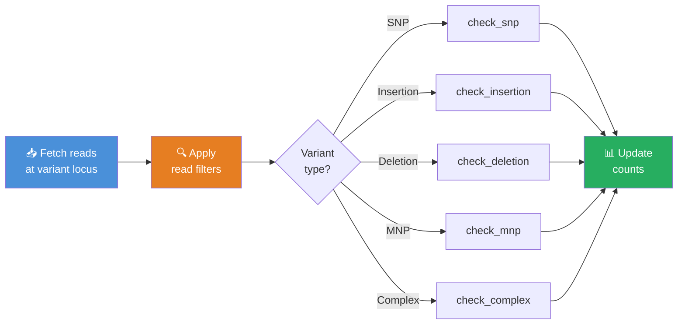

---

## Read Filter Pipeline

Before any allele checking begins, every read passes through a **filter cascade**. Reads that fail any enabled filter are discarded. The order matches the Rust engine implementation.

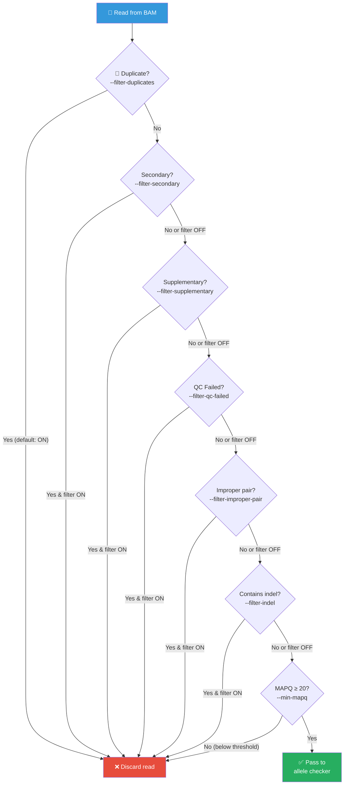

| Filter | CLI Flag | Default | SAM Flag |
|:-------|:---------|:--------|:---------|
| Duplicates | `--filter-duplicates` | **On** | `0x400` |
| Secondary | `--filter-secondary` | Off | `0x100` |
| Supplementary | `--filter-supplementary` | Off | `0x800` |
| QC Failed | `--filter-qc-failed` | Off | `0x200` |
| Improper Pair | `--filter-improper-pair` | Off | `0x2` (inverted) |
| Indel reads | `--filter-indel` | Off | CIGAR-based |
| MAPQ threshold | `--min-mapq` | **20** | — |
| BASEQ threshold | `--min-baseq` | **0** | — (per-type) |

!!! note "Filter Non-Primary"
    The original GBCMS has a single `--filter_non_primary` flag. py-gbcms splits this into `--filter-secondary` and `--filter-supplementary` for finer control. Both default to **off**, matching the original behavior.

---

## Variant Types

### SNP (Single Nucleotide Polymorphism)

A single base substitution — the simplest and most common variant type.

| Property | Value |
|:---------|:------|
| Detection | `len(REF) == 1 && len(ALT) == 1` |
| Position | 0-based index of the substituted base |
| Quality check | Base quality at the position must meet `--min-baseq` |

#### Algorithm Flow

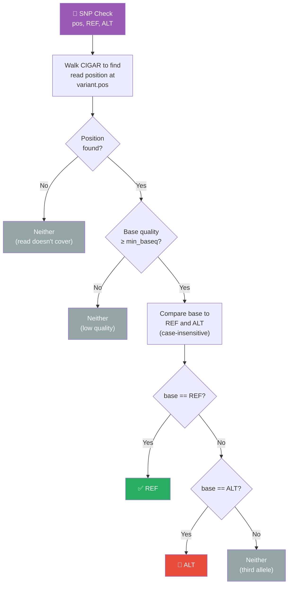

#### Visual Example

```
Variant: chr1:100 C→T (SNP)

Reference: 5'─ ...G  A  T  C  G  A  T  C  G  A... ─3'
                          98 99 100 101
                               ▲
                           variant pos

Read 1:    5'─ ...G  A  T [T] G  A  T  C... ─3'   → ALT ✅
                               ↑
                          base=T matches ALT

Read 2:    5'─ ...G  A  T [C] G  A  T  C... ─3'   → REF ✅
                               ↑
                          base=C matches REF

Read 3:    5'─ ...G  A  T [A] G  A  T  C... ─3'   → Neither
                               ↑
                          base=A ≠ REF or ALT
```

---

### Insertion

Bases inserted after an **anchor** position. The anchor is the last reference base before the inserted sequence.

| Property | Value |
|:---------|:------|
| Detection | `len(REF) == 1 && len(ALT) > 1` |
| Position | 0-based index of the **anchor** base |
| Quality check | None (CIGAR-structural check only) |

#### Algorithm Flow

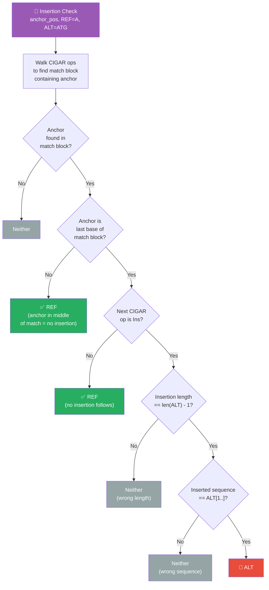

#### Visual Example

```
Variant: chr1:100 A→ATG (insertion of TG after anchor A)

Reference:     5'─ ...C  G  A ── C  G  T  A... ─3'
                          99 100  101 102
                               ▲
                          anchor pos

Read 1 (ALT):  CIGAR = 5M 2I 5M
               5'─ ...C  G  A [T  G] C  G  T  A... ─3'
                               └──┘
                          inserted bases match ALT → ALT ✅

Read 2 (REF):  CIGAR = 10M
               5'─ ...C  G  A  C  G  T  A... ─3'
                               ↑
                          no insertion after anchor → REF ✅

Read 3 (other): CIGAR = 5M 1I 5M
               5'─ ...C  G  A [C] C  G  T  A... ─3'
                               ↑
                          1bp insertion ≠ expected 2bp → Neither
```

!!! tip "Why anchor-based?"
    In VCF format, insertions are represented as `REF=A, ALT=ATG` where the first base `A` is the anchor — it's not part of the inserted sequence. py-gbcms uses this anchor to locate where the insertion should occur in the CIGAR string.

---

### Deletion

Bases deleted after an **anchor** position. The logic mirrors insertion but looks for `Del` CIGAR operations.

| Property | Value |
|:---------|:------|
| Detection | `len(REF) > 1 && len(ALT) == 1` |
| Position | 0-based index of the **anchor** base |
| Quality check | None (CIGAR-structural check only) |

#### Algorithm Flow

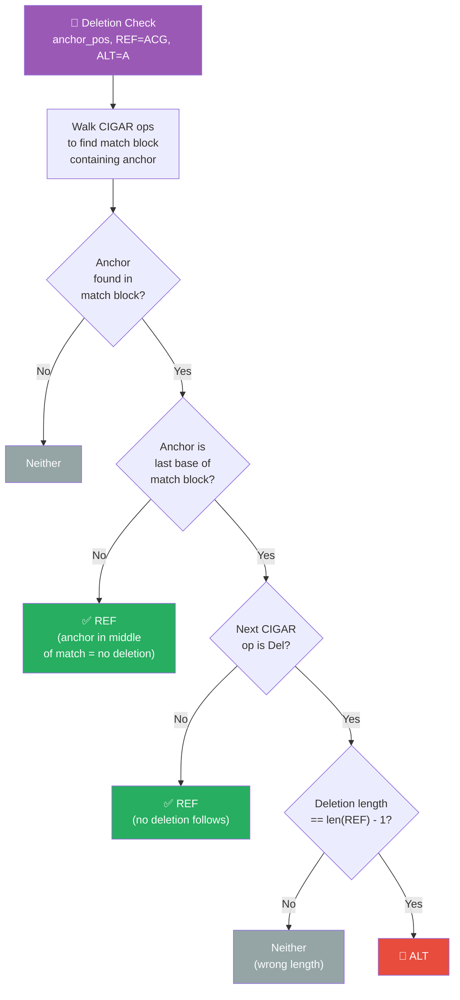

#### Visual Example

```
Variant: chr1:100 ACG→A (deletion of CG after anchor A)

Reference:     5'─ ...T  G  A  C  G  T  A  C... ─3'
                          99 100 101 102
                               ▲
                          anchor pos

Read 1 (ALT):  CIGAR = 5M 2D 5M
               5'─ ...T  G  A  ──  ──  T  A  C... ─3'
                               └─────┘
                          2bp deletion matches len(REF)-1 → ALT ✅

Read 2 (REF):  CIGAR = 12M
               5'─ ...T  G  A  C  G  T  A  C... ─3'
                               ↑
                          no deletion after anchor → REF ✅

Read 3 (other): CIGAR = 5M 3D 5M
               5'─ ...T  G  A  ──  ──  ──  A  C... ─3'
                               └────────┘
                          3bp deletion ≠ expected 2bp → Neither
```

---

### MNP (Multi-Nucleotide Polymorphism)

Multiple adjacent bases substituted simultaneously. Think of it as multiple SNPs happening at consecutive positions.

| Property | Value |
|:---------|:------|
| Detection | `len(REF) == len(ALT) && len(REF) > 1` |
| Position | 0-based index of the first substituted base |
| Quality check | **Every** base in the MNP region must meet `--min-baseq` |

#### Algorithm Flow

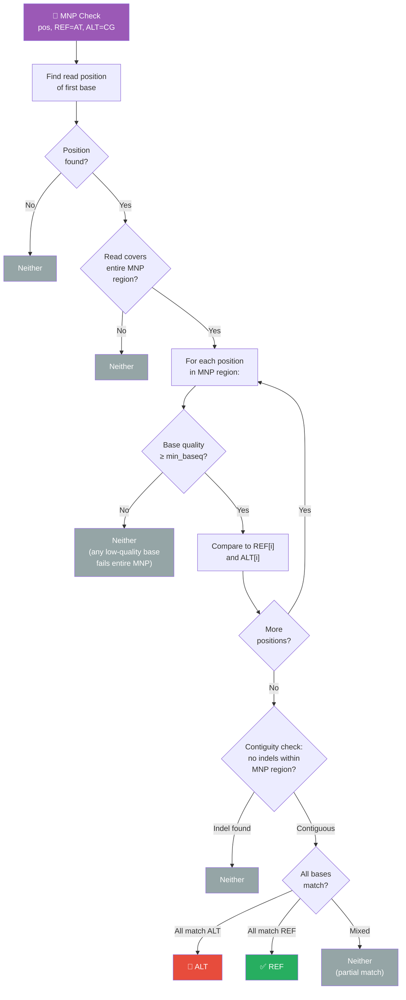

#### Visual Example

```
Variant: chr1:100 AT→CG (2-base MNP)

Reference:     5'─ ...G  A  T  A  T  G  C... ─3'
                          99 100 101
                              ▲───▲
                           MNP region

Read 1 (ALT):  5'─ ...G  A  T [C  G] G  C... ─3'   → ALT ✅
                              └──┘
                         both bases match ALT: C=C ✓, G=G ✓

Read 2 (REF):  5'─ ...G  A  T [A  T] G  C... ─3'   → REF ✅
                              └──┘
                         both bases match REF: A=A ✓, T=T ✓

Read 3 (mixed): 5'─ ...G  A  T [C  T] G  C... ─3'  → Neither
                              └──┘
                         C=ALT[0] ✓, but T=REF[1] ✗  (partial match)

Read 4 (indel): CIGAR = 3M 1I 3M
                5'─ ...G  A  T [C] X [G] G  C... ─3' → Neither
                                   ↑
                         indel within MNP region → fails contiguity check
```

!!! warning "Strict matching"
    MNP matching is **all-or-nothing**: every base must match either REF or ALT. A read with `C T` at a `AT→CG` variant (matching the first ALT base but second REF base) is classified as **neither** — it's not counted for either allele.

---

### Complex (Indel + Substitution)

Variants where REF and ALT differ in both sequence **and** length. This is the catch-all category that uses a sophisticated **haplotype reconstruction** algorithm.

| Property | Value |
|:---------|:------|
| Detection | Fallback for all other combinations |
| Position | 0-based index of the first reference base |
| Quality check | Minimum base quality across all reconstructed bases must meet `--min-baseq` |

#### Algorithm Flow — Haplotype Reconstruction

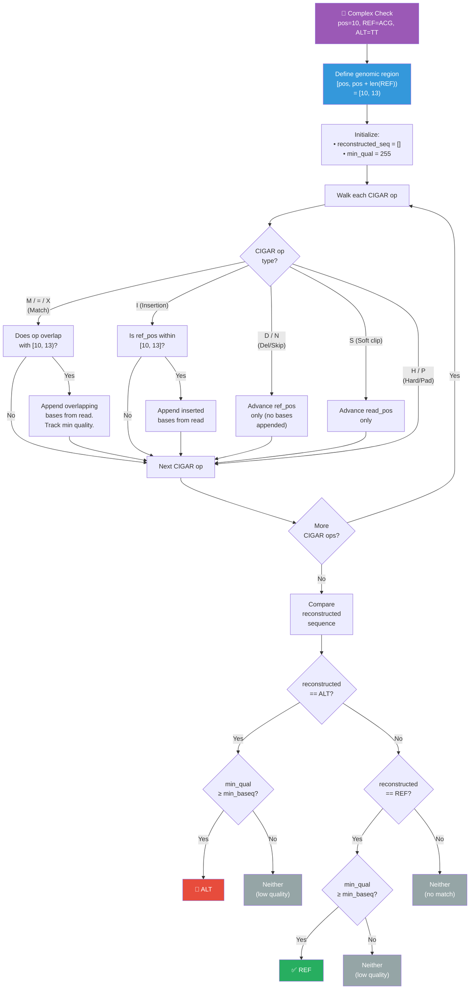

#### Worked Example: Step-by-Step Reconstruction

Here's a concrete example showing how the engine reconstructs a read's sequence for a complex variant.

```
Variant: chr1:10 ACG→TT (complex: 3bp REF → 2bp ALT)
Region:  [10, 13)   (0-based, half-open)
```

**Read supporting ALT** — CIGAR: `10M 1D 1I 8M`

```
Step-by-step CIGAR walk:

  CIGAR op    ref_pos  read_pos  Overlap with [10,13)?  Action
  ─────────   ───────  ────────  ─────────────────────  ──────────────────────
  10M         0→10     0→10      [10,10) = none         (just advance)
  ⚠️ Wait — let's reconsider. 10M covers ref [0,10), read [0,10).
     overlap with [10,13) = none yet.

  Actually, the 10M goes from ref 0 to 10 (exclusive).
  After 10M: ref_pos=10, read_pos=10.

  1D          10→11    (no read)  ref_pos 10 is in [10,13)
                                  But Del → no bases appended, ref advances
              After: ref_pos=11, read_pos=10

  1I          11       10→11     ref_pos=11 is in [10,13]
                                  Append 1 inserted base from read[10]
                                  reconstructed = "T"
              After: ref_pos=11, read_pos=11

  8M          11→19    11→19     overlap [11,13) = 2 bases
                                  Append read[11] and read[12]
                                  reconstructed = "T" + "T" = "TT"
              After: ref_pos=19, read_pos=19

  ─────────────────────────────────────────────────────────────────
  Result: reconstructed = "TT"
          Compare to ALT = "TT" → ✅ Match! → ALT
```

**Read supporting REF** — CIGAR: `20M`

```
  CIGAR op    ref_pos  read_pos  Overlap with [10,13)?  Action
  ─────────   ───────  ────────  ─────────────────────  ──────────────
  20M         0→20     0→20      [10,13) = 3 bases
                                  Append read[10], read[11], read[12]
                                  reconstructed = "ACG"

  ─────────────────────────────────────────────────────────────────
  Result: reconstructed = "ACG"
          Compare to ALT = "TT"  → length 3 ≠ 2 → no match
          Compare to REF = "ACG" → ✅ Match! → REF
```

!!! info "Auto-detection"
    If a variant's type string is unknown, py-gbcms auto-detects MNPs (equal-length REF/ALT with length > 1) and falls back to the complex haplotype reconstruction for everything else.

---

## Counting Levels

After allele classification, py-gbcms tracks counts at **two levels**: individual reads and collapsed fragments.

### Read-Level vs Fragment-Level

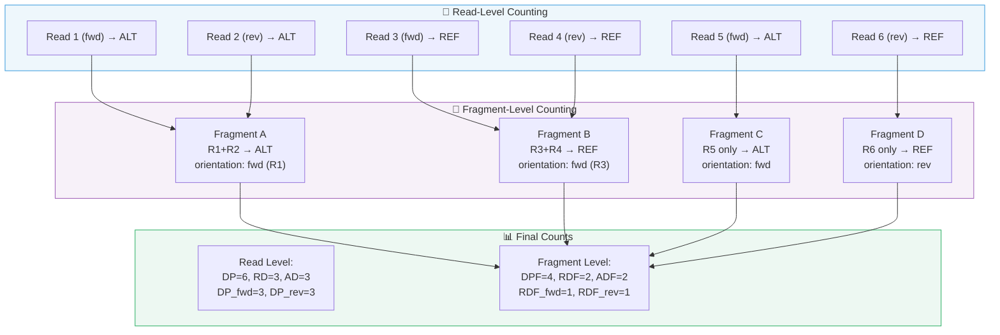

### Read-Level Metrics

Each read is counted independently.

| Metric | Description |
|:-------|:------------|
| **DP** | Total depth (reads supporting REF or ALT) |
| **RD** / **AD** | Reference / Alternate read counts |
| **DP_fwd** / **DP_rev** | Strand-specific total depth |
| **RD_fwd** / **RD_rev** | Strand-specific reference counts |
| **AD_fwd** / **AD_rev** | Strand-specific alternate counts |

### Fragment Counting Algorithm

Fragment counting collapses read pairs into a single observation per fragment.

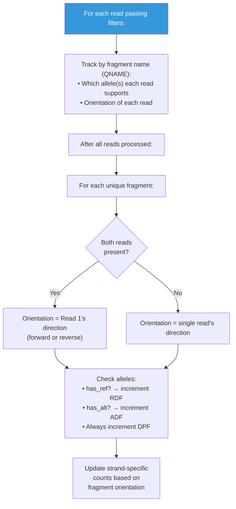

| Metric | Description |
|:-------|:------------|
| **DPF** | Fragment depth |
| **RDF** / **ADF** | Reference / Alternate fragment counts |
| **RDF_fwd** / **RDF_rev** | Strand-specific reference fragment counts |
| **ADF_fwd** / **ADF_rev** | Strand-specific alternate fragment counts |

!!! tip "Why fragment counting matters for cfDNA"
    In cfDNA sequencing (like MSK-ACCESS), the same DNA fragment is often sequenced from both ends. Counting reads would double-count each fragment. Fragment-level counting gives a more accurate picture of the number of **unique molecules** supporting each allele.

---

### Strand Bias (Fisher's Exact Test)

Strand bias detects when an allele is disproportionately supported by reads on one strand — a common sequencing artifact.

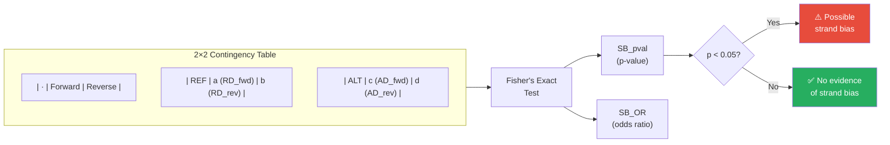

Computed at **both** levels:

| Metric | Level | Description |
|:-------|:------|:------------|
| **SB_pval** / **SB_OR** | Read | Strand bias from individual reads |
| **FSB_pval** / **FSB_OR** | Fragment | Strand bias from collapsed fragments |

!!! example "Strand bias example"
    If a variant has `AD_fwd=15, AD_rev=1`, that's suspicious — almost all ALT-supporting reads are on the forward strand. Fisher's test would yield a low p-value, flagging this as a potential artifact rather than a true variant.

---

## Full Pipeline: End-to-End Example

Here's how a single variant is processed through the complete pipeline:

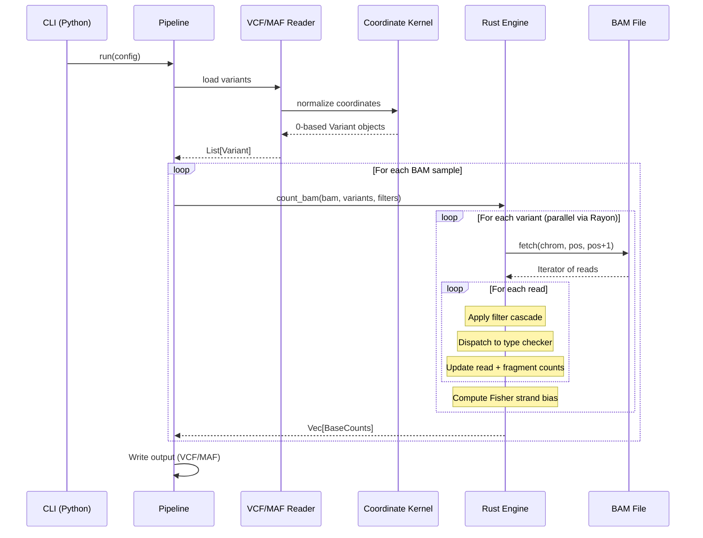

---

## Comparison with Original GBCMS

| Feature | Original GBCMS | py-gbcms |
|:--------|:---------------|:---------|
| Counting algorithm | Region-based chunking, position matching | Per-variant CIGAR traversal |
| Complex variants | Optional via `--generic_counting` | Always uses haplotype reconstruction |
| MNP handling | Not explicit | Dedicated `check_mnp` with contiguity check |
| Fragment counting | Optional (`--fragment_count`) | Always computed |
| Positive strand counts | Optional (`--positive_count`) | Always computed |
| Strand bias | Not computed | Fisher's exact test (read + fragment level) |
| Fractional depth | `--fragment_fractional_weight` | Not implemented |
| Parallelism | OpenMP block-based | Rayon per-variant |

## Related

- [Architecture](architecture.md) — System design overview
- [Input Formats](input-formats.md) — VCF and MAF specifications
- [Glossary](glossary.md) — Term definitions
- [CLI Run Command](../cli/run.md) — All parameter options
