# Variant Normalization

How py-gbcms prepares variants before counting — validation, left-alignment, and homopolymer decomposition.

!!! info "Visual Overview"
    <figure markdown="span">
      { loading=lazy width="100%" }
      <figcaption>The 5-step variant normalization pipeline — click to enlarge</figcaption>
    </figure>

## Overview

Before counting any reads, every variant passes through the **preparation pipeline** in `prepare_variants()`. This ensures consistent, biologically correct coordinates regardless of how the input was generated.


Each input variant produces **exactly one** `PreparedVariant`, even if validation fails — this guarantees output row count always matches input.

---

## Step 1: MAF Anchor Resolution

MAF files represent indels using `-` dashes. py-gbcms converts them to VCF-style **anchor-based** coordinates, which requires fetching the anchor base from the reference FASTA.

| Indel Type | MAF REF | MAF ALT | VCF REF | VCF ALT | Anchor Source |
|:-----------|:--------|:--------|:--------|:--------|:--------------|
| Insertion | `-` | `TG` | `A` | `ATG` | Fetch base at `Start_Position` |
| Deletion | `CG` | `-` | `ACG` | `A` | Fetch base at `Start_Position − 1` |

!!! note "When Is This Step Triggered?"
    Only for MAF input (`is_maf=true`) when REF or ALT is `-`, or when REF and ALT have different lengths (complex indels). VCF input skips this step entirely.

!!! warning "FETCH_FAILED"
    If the anchor base cannot be fetched (e.g., chromosome not in FASTA), the variant's `validation_status` is set to `FETCH_FAILED` and it is excluded from counting.

---

## Step 2: REF Validation

The REF allele is compared against the reference genome at the stated position. An exact match passes immediately. If the exact match fails, a **similarity score** is computed — variants with ≥90% base match are corrected to the FASTA REF and proceed to counting.

```mermaid
flowchart TD
    Fetch["Fetch ref bases at pos"] --> Exact{"Exact match?"}
    Exact -- "Yes" --> Pass([✅ PASS]):::pass
    Exact -- "No" --> Sim["Compute similarity\n(matching bases / max length)"]
    Sim --> Thresh{"≥ 90%?"}
    Thresh -- "Yes" --> Corrected(["⚠️ PASS_WARN_REF_CORRECTED\n(use FASTA REF)"]):::warn
    Thresh -- "No" --> Fail([❌ REF_MISMATCH]):::fail

    classDef pass fill:#27ae60,color:#fff;
    classDef warn fill:#f39c12,color:#fff;
    classDef fail fill:#e74c3c,color:#fff;
```



When a variant receives `PASS_WARN_REF_CORRECTED`, the MAF's REF allele is **replaced with the FASTA sequence** for all downstream steps (left-alignment, haplotype construction). The original MAF REF is preserved in `original_ref` for auditing.

!!! example "Real-World Example: EGFR Exon 19 Deletion"
    A 27bp complex EGFR deletion had 26/27 bases matching the FASTA (96%), with only the last base differing due to a MAF annotation artifact. Without tolerance, this variant was silently rejected with zero counts. With tolerant validation, it receives `PASS_WARN_REF_CORRECTED` and produces valid counts.

!!! important "Common Causes of REF_MISMATCH"
    - Wrong reference genome version (GRCh37 vs GRCh38)
    - Chromosome naming mismatch (`chr1` vs `1`)
    - Variant was called against a different reference build
    - Upstream normalization changed coordinates incorrectly
    - MAF annotation artifact (trailing base error) — now handled by tolerant validation

---

## Step 3: Left-Alignment

For indels and complex variants, py-gbcms applies **bcftools-style left-alignment** to ensure consistent positioning in repetitive regions.

```mermaid
flowchart TD
    Input["Indel: chr1:105 ACG→A<br/>(in a CGCG repeat)"]
    Fetch["Fetch ±100bp flanking sequence"]
    Align["Shift left through repeat"]
    Result["chr1:101 ACG→A<br/>(leftmost position)"]

    Input --> Fetch --> Align --> Result
```



| Parameter | Value | Description |
|:----------|:------|:------------|
| `norm_window` | 100bp initial, up to 2500bp | Initial window for leftward search. Doubles on edge-hit (exponential retry). |
| `max_norm_window` | 2500bp | Safety cap for centromeric/telomeric regions |
| Trigger | `ref_len ≠ alt_len` or both >1bp | SNPs are never left-aligned |

!!! tip "Dynamic Window Expansion"
    If a variant shifts all the way to the window edge during left-alignment, it may not have fully converged. The engine automatically **doubles the window** (100 → 200 → 400 → ... → 2500bp) and retries. This ensures correct normalization even for variants in massive tandem repeats (e.g., centromeric regions) without penalizing the common case.

After alignment, the **variant type is re-detected** based on the new allele lengths:

| Condition | Assigned Type |
|:----------|:-------------|
| `ref_len == 1 && alt_len == 1` | SNP |
| `ref_len == 1 && alt_len > 1` | INSERTION |
| `ref_len > 1 && alt_len == 1` | DELETION |
| Otherwise | COMPLEX |

!!! tip "Debugging Normalization"
    Use `gbcms normalize` to see exactly how each variant was transformed. The output TSV shows original and normalized coordinates side by side, plus whether the variant was modified (`was_normalized=true`).

---

## Step 4: ref_context Fetch (Adaptive)

For indels and complex variants, a flanking reference sequence is fetched around the (possibly normalized) position. This context serves two purposes:

1. **Windowed indel detection** — Safeguard 3 uses `ref_context` to verify that shifted indels delete/insert the expected reference bases
2. **Phase 3 Smith-Waterman alignment** — the context is used to build REF and ALT haplotypes for dual-haplotype alignment

### Adaptive Context Padding

By default, py-gbcms **dynamically adjusts** the context padding based on nearby tandem repeats. This prevents ambiguous SW alignments in repetitive regions where a fixed padding might consist entirely of the repeat motif.

#### Multi-Anchor Footprint Sweep
Historically, scanning only the variant's strict `anchor` base caused miscalculations for left-aligned INDELs, as the trailing INDEL mutations generated by BWA mapping often fell outside the default `5bp` padding window.

The engine now performs a **Multi-Anchor Footprint Sweep**. It scans across the entire variant footprint (`pos` through `pos + ref_len`) looking for tandem repeats, and extracts the maximum necessary padding to clear the repeat entirely.


| Parameter | CLI Flag | Default | Description |
|:----------|:---------|:--------|:------------|
| `context_padding` | `--context-padding` | 5 | Minimum flanking bases on each side (range: 1–50) |
| `adaptive_context` | `--adaptive-context` | ✅ enabled | Dynamically increase padding across the footprint in repeat regions |

#### Example: Poly-A Insertion

```
Variant: chr7:100 A→AAAAAAAAAAAAA (12bp poly-A insertion)
Footprint: chr7:100-101
Flanking: ...AAAAAAAAAA[anchor]AAAAAAAAAA...

Sweep Detected: homopolymer max span=20bp → padding = max(5, 20/2+3) = 13bp

Fixed padding=5:     AAAAA + REF/ALT + AAAAA  (all A's — ambiguous, BWA alignments drop)
Adaptive padding=13: GCTTAAAAA... + REF/ALT + ...AAAAATTGAC  (anchored)
```

#### Supported Repeat Types

| Type | Example | Motif Size | Detection Range |
|:-----|:--------|:----------:|:---------------:|
| Homopolymer | `AAAAAAA` | 1bp | ≥2 copies |
| Dinucleotide | `CACACACA` | 2bp | ≥2 copies |
| Trinucleotide | `CAGCAGCAG` | 3bp | ≥2 copies |
| Up to hexanucleotide | `GGCCCCGGCCCC` | 4–6bp | ≥2 copies |

!!! tip "Disabling Adaptive Context"
    Use `--no-adaptive-context` to fall back to fixed padding. This may be useful for strict reproducibility against older versions.

!!! note "SNPs Don't Need Context"
    SNPs are checked by a simple single-base comparison, so `ref_context` is not fetched for them. This saves unnecessary FASTA lookups.

---

## Step 5: Homopolymer Decomposition Detection

Some variant callers merge nearby events (e.g., a 1bp deletion + SNV in a homopolymer) into a single complex variant with an inflated deletion size. For example, `CCCCCC→T` when the reads actually show `CCCCCC→CCCCT` (a D(1) + C→T).

### Detection Criteria

All four conditions must be met:

```mermaid
flowchart TD
    C1{"REF is homopolymer?<br/>(all same base, ≥3bp)"} -- Yes --> C2{"Net deletion?<br/>(ref_len > alt_len)"}
    C2 -- Yes --> C3{"ALT last base ==<br/>next ref base after REF span?"}
    C3 -- Yes --> C4{"ALT last base ≠<br/>homopolymer base?"}
    C4 -- Yes --> Detected([🔍 Decomposition detected]):::detect

    C1 -- No --> Skip([Skip]):::skip
    C2 -- No --> Skip
    C3 -- No --> Skip
    C4 -- No --> Skip

    classDef detect fill:#f39c12,color:#fff,stroke:#d68910,stroke-width:2px;
    classDef skip fill:#95a5a6,color:#fff,stroke:#7f8c8d,stroke-width:2px;
```



### Corrected Allele Construction

When detected, a **corrected ALT allele** is built by keeping most of the homopolymer intact and appending the SNV base:

```
Example:  REF = CCCCCC, ALT = T, next_ref_base = T

Step 1: homopolymer base = C
Step 2: Confirmed: alt_last (T) == next_ref_base (T), T ≠ C
Step 3: corrected_alt = C × (ref_len - 1) + alt_last = CCCCC + T = CCCCT
```

### Dual-Counting Flow

The corrected variant is stored in `PreparedVariant.decomposed_variant`. During counting, **both** the original and corrected alleles are counted independently. The result with the higher `alt_count` wins:


!!! info "Self-Validating"
    The warning flag only appears when reads *actually* support the decomposed representation better. If the original variant gets more ALT support, it's used as-is with a normal `PASS` status. This makes the approach safe — it never blindly corrects variants.

!!! example "Real-World: SOX2"
    **SOX2** at chr17:181430901: `CCCCCC→T` (6bp→1bp, net −5bp).
    Original count: **alt=3**. Corrected `CCCCCC→CCCCT` count: **alt=79**.
    Corrected wins → `validation_status = PASS_WARN_HOMOPOLYMER_DECOMP`.

---

## Validation Status Reference

Every `PreparedVariant` carries a `validation_status` string:

| Status | Meaning | Counted? |
|:-------|:--------|:--------:|
| `PASS` | REF matches FASTA exactly | ✅ |
| `PASS_WARN_REF_CORRECTED` | REF ≥90% match; corrected to FASTA REF | ✅ |
| `PASS_WARN_HOMOPOLYMER_DECOMP` | Passed, but corrected allele was used (see above) | ✅ |
| `PASS_MULTI_ALLELIC` | Passed, variant overlaps another variant at the same locus (sibling ALT exclusion active) | ✅ |
| `REF_MISMATCH` | REF allele <90% match against reference genome | ❌ |
| `FETCH_FAILED` | Could not fetch reference region | ❌ |

!!! note "Filtering Behavior"
    The pipeline filters on `validation_status.startswith("PASS")`, so all `PASS` and `PASS_WARN_*` variants proceed to counting. `REF_MISMATCH` and `FETCH_FAILED` variants are logged as rejected.

---

## Limitations

1. **Left-alignment only** — py-gbcms left-aligns but does not right-align. If your input is right-aligned, the windowed scan (±5bp) may still catch it, but left-alignment is recommended.
2. **Dynamic normalization window** — Starting at 100bp, the window automatically doubles (up to 2500bp) when a variant shifts to the window edge. In practice, this covers even variants in centromeric/telomeric repeats. Variants shifted beyond 2500bp won't be corrected.
3. **Homopolymer detection is conservative** — only triggers for homopolymer REF ≥3bp with a clear D(n)+SNV pattern. Other miscollapsed events are not detected.

---

## Related

- [gbcms normalize](../cli/normalize.md) — CLI command for standalone normalization
- [Input Formats](input-formats.md) — VCF/MAF coordinate conventions
- [Allele Classification](allele-classification.md) — How reads are classified after normalization
